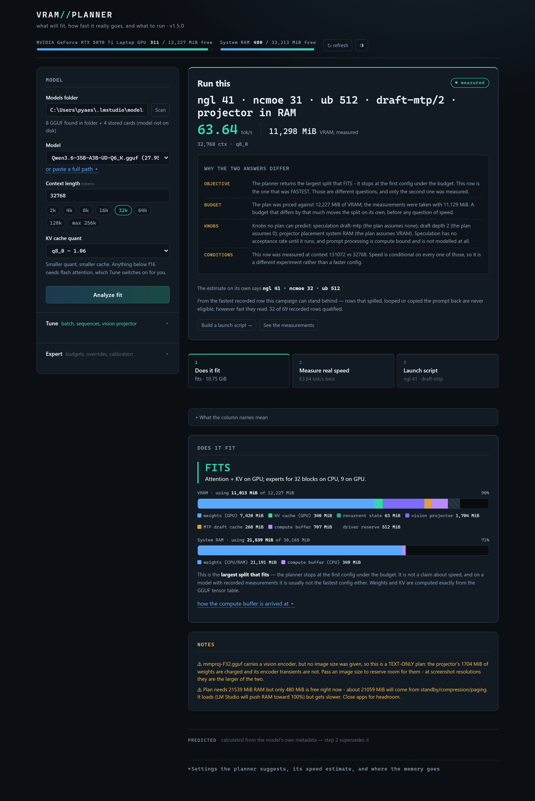

# VRAM Planner

A self-contained Python package (standard library only). It parses any GGUF
**directly** (reads the real byte size of every tensor — the same info as
`npx @huggingface/gguf --show-tensor`, but with no npx/Node dependency), reads
your live free VRAM + RAM, and tells you exactly how a model fits at any context
length and KV-cache quant:

- **Dense models** → how many layers go on the GPU (`-ngl` / LM Studio "GPU Layers").
- **MoE models** → how many layers' experts to keep on CPU (`--n-cpu-moe` / `-ot`),
  keeping attention + router + shared experts on the GPU.
- Max context that still fits fully on the GPU, a KV-cache-vs-context table, and a
  full memory breakdown.
- The one estimated term (the compute buffer) can be re-fitted to **your** machine
  with a `--sweep`/`--fit` harness — see **Measuring it yourself**.

It serves its own web UI, so you never type these commands by hand. The UI opens on
a single recommended config, says whether that came from **measurement** or from the
planner's **estimate**, and — when the two disagree — names every reason why. See
**"Largest that fits" is not "fastest"**.

## Using the interface



Four controls and a button get you an answer. Everything else is behind two
disclosures, and the results column shows **one thing at a time**.

**The recommendation, at the top.** One config to run, badged `● measured` or
`estimated`. A trustworthy measured row supersedes the planner's arithmetic; rows that
spilled into shared memory, looped, or copied the prompt back are never eligible however
fast they read. When the measured answer and the estimate disagree, the card names each
reason rather than leaving you to spot it — see
[**"Largest that fits" is not "fastest"**](#largest-that-fits-is-not-fastest--and-the-two-used-to-disagree-silently).

**Three steps, in the order they depend on each other.** Only the open one renders; the
other two carry their answer on the tab, so nothing is hidden that you would have to go
looking for.

| step | answers | tab reads |
|---|---|---|
| **1 · Does it fit** | the verdict, the memory bars, and behind one disclosure everything the planner *derives* — suggested settings, the `llama-server` command, the speed estimate, the KV-vs-context table, the full breakdown | `fits, barely · 10.75 GiB` |
| **2 · Measure real speed** | the grid, a preview of what it will cost in hours, live rows as they land, and **Past sweeps** — every campaign ever recorded on this machine | `63.64 tok/s best` |
| **3 · Launch script** | a complete `.ps1`/`.sh` for the selected row, with template, sampler and load-mode controls | `ngl 41 · draft-mtp` |

Steps 2 and 3 need **no model analyzed and touch no GPU** — reading a recorded campaign
and building a script from one of its rows is what the page offers before you have
pressed Analyze at all.

**Three tiers of control.** *Model* holds the four things every plan needs. *Tune* holds
ubatch, sequences, flash attention and the vision projector. *Expert* holds the budgets,
the layer overrides, the bandwidth figures and calibration. Nothing was removed — the
long explanations that used to sit under every field are one click away under a dotted
**why**, so the page answers first and explains on request.

**A glossary** under the steps defines the six abbreviations that head every row table
(`ngl`, `ncmoe`, `ub`, `fill`, `spec`, `proj`); the same text is the `title` on each
column header.

The page is theme-aware: it follows your OS setting, and the ◐ button in the header
overrides it in both directions.

**Checking a plan against reality.** A configuration loaded in LM Studio, with Task
Manager showing what the engine actually allocates:


### Regenerating the screenshots

`docs/ui-*.png` are captured from the running app rather than drawn, so they cannot
drift into describing an interface that no longer exists — but they do have to be
retaken after a UI change. The capture drives headless Chrome over the DevTools
protocol; Node 22+ ships a WebSocket client, so it needs nothing installed:

1. `python -m vram_planner --port 8140 --no-browser`
2. `chrome --headless --remote-debugging-port=9222 --user-data-dir=<tmp> about:blank`
3. connect to `http://127.0.0.1:9222/json`, drive the page with `Runtime.evaluate`,
   and capture with `Page.captureScreenshot` (`captureBeyondViewport: true` and a clip
   from `Page.getLayoutMetrics` for a full-page shot).

Two things worth knowing if you write that script. `app.js` is a classic script, so its
top-level `let` bindings — `LAST`, `SWEEP`, `REC` — live in the global *lexical* scope
and are reachable as bare identifiers but **never** as `window.LAST`. And wait on what
is painted, not on the state behind it: the step tabs are redrawn by a later callback
than the fetch that feeds them, so polling the data captures a loading label.

## Supported platforms

| | status |
|---|---|
| **Windows + NVIDIA** | validated — all measurements below were taken here |
| **Linux + NVIDIA** | should work (`nvidia-smi` + `/proc/meminfo` paths exist), untested |
| macOS / Metal | **unvalidated** — the tool warns and keeps running |
| AMD / ROCm, Intel | **unvalidated** — same warning |

The split matters because only *part* of the tool is hardware-dependent. Weights, KV
cache, recurrent state and the projector are read from your GGUF and are exact
everywhere. The **compute-buffer estimate** was fitted against CUDA on Windows, and
Metal/ROCm allocate their graphs differently — so on those the total is indicative
until you calibrate it. The tool detects this and says so in the terminal and the UI
rather than quietly reporting a confident wrong number.

Per-process VRAM measurement (**Measure running model**, under *Expert*) additionally
needs `nvidia-smi` or Windows GPU performance counters, and reading LM Studio's
*resolved* config needs its Windows log path.

## Requirements
- Python 3.8+ (standard library only — nothing to `pip install`).
- NVIDIA driver on PATH for **live** VRAM (`nvidia-smi`, installed with your driver).
  If it's missing, everything still works — just type your VRAM budget manually.

## Run
```powershell
python -m vram_planner
# or, if that isn't found:
py -m vram_planner
```
Run it from the folder containing the `vram_planner/` package.
A browser opens at http://localhost:8121. Point the **Models folder** at your
LM Studio models dir (defaults to `%USERPROFILE%\.lmstudio\models`), pick a model,
set context + KV quant, and press **Analyze fit**.

Calibration, model cards and measured rows live in `%LOCALAPPDATA%\vram-planner\`
(`~/.local/share/vram-planner/` elsewhere), not next to the script.

### Command-line reference

Nothing below is required to use the tool — the web UI drives all of it. `--self-test`
is the one worth running after a change.

**Serving and testing**

| flag | |
|---|---|
| `--port N` / `--host H` / `--no-browser` | defaults `8121`, `127.0.0.1`, opens a browser |
| `--self-test` | synthetic GGUFs, the planner math, and every invariant the modules promise |
| `--require-refs` | with `--self-test`: fail rather than skip when a real-load section cannot run |
| `--version` | |

**Allocation sweep** — fitting the compute buffer (see [Measuring it yourself](#measuring-it-yourself))

| flag | |
|---|---|
| `--sweep` | drive `llama-server` across a config grid, recording what it allocates |
| `--dry-run` | with `--sweep`: print the configs and the estimate, run nothing |
| `--models NAME…` | only models whose file name contains one of these |
| `--backend BUILD` | llama.cpp build to drive (default: newest CUDA build found) |
| `--limit N` | stop after this many configs |
| `--sweep-timeout SECONDS` | per-load timeout, default 420 |
| `--probe MODEL AXIS=V,V` | one-off: run named values without recording a campaign |
| `--fit` | score the compute-buffer model against recorded rows, **held out** |
| `--recalibrate` | refit the coefficients from stored rows, save, exit |
| `--show-calibration` | the stored fit and where it came from |

**Speed sweep** — measuring tok/s (see [Measuring speed](#measuring-speed) and
[docs/speed-sweep.md](docs/speed-sweep.md))

| flag | |
|---|---|
| `--speed-sweep` | drive `llama-server` across a grid, recording how fast it generates |
| `--speed-stages LETTERS` | which stages run, default `abcd` — A layer wall, B projector, C ubatch, D speculation |
| `--speed-axes AXIS=V,V` | sweep exact values as a cross product instead of the stages |
| `--speed-ctx N` / `--speed-kv TYPE` | freeze context and KV quant for the campaign |
| `--speed-fill TOKENS` | prompt depth to measure at — decode slows as context fills, so this conditions every row |
| `--speed-chain` | build each stage from the previous stage's winner rather than one fixed baseline |
| `--speed-rounds N` | with `--speed-chain`: re-run the stages from the winner |
| `--speed-verify` | after the campaign, load the winner at the production config |
| `--speed-verify-overrides AXIS=V,V` | what "production" means, e.g. `spec=draft-mtp spec_n_max=2` |
| `--n-predict N` / `--repeat N` | tokens per pass (128) and passes per config (3, median) |
| `--chat-template-file PATH` | pin the template — a row measured under another one is a different experiment |
| `--chat-template-kwargs JSON` | template variables, e.g. `{"reasoning_effort":"xhigh"}` |
| `--reasoning {auto,on,off}` / `--reasoning-preserve {default,on,off}` | thinking, and whether it survives the history |
| `--refresh-corpus` | rebuild the frozen filler corpus (see [Measuring speed](#measuring-speed) before you do) |

**Reading and forgetting**

| flag | |
|---|---|
| `--speed-report` | every recorded row, fastest first |
| `--insights` | with `--speed-report`: what the campaigns *found* instead of the flat ranking |
| `--forget-sweep MODEL…` | forget recorded campaigns — lists what matches, then asks |
| `--yes` | with `--forget-sweep`: skip the prompt |
| `--cards` | list stored model cards |
| `--add-card GGUF…` / `--forget-card NAME…` | record or drop one explicitly |

## Layout
Each module imports only from those above it, so the import graph is a DAG and
every number has one home:

| module | what lives there |
|---|---|
| `const` | version, byte units |
| `gguf` | the GGUF binary reader |
| `model` | config extraction, tensor classification |
| `kv` | cache geometry — exact, read from metadata |
| `compute` | the compute buffer — the one fitted term |
| `paths` | user data locations |
| `gpu` | live hardware probes |
| `lmstudio` | models, runtime config, server logs, backends |
| `speed` | bandwidth roofline |
| `calib` | fitting `compute` to this machine's measurements |
| `plan` | `analyze()` and the layer-split planners |
| `sweep` | driving `llama-server` across a config grid, recording what it allocates |
| `bench` | driving it across a grid and recording how fast it **generates** |
| `_corpus.txt` | the frozen benchmark filler, committed on purpose — never delete (see *Measuring speed*) |
| `fit` | scoring `compute` against sweep data, held out |
| `recommend` | one config to run — reconciling `plan`'s estimate against `bench`'s measured rows, and naming every reason the two differ |
| `launch` | turning a config into a runnable `llama-server` launch script |
| `job` | the one background campaign the web UI can start and watch |
| `web` | JSON endpoints and static file serving |
| `ui/` | `index.html`, `app.css`, `app.js` — the front end, as real files |
| `selftest` | synthetic GGUFs and the test suite |
| `cli` | entry point |

`sweep`, `bench` and `fit` are the evidence base, not part of a plan — nothing above
imports them and the tool works without ever running any of them. See **Measuring it
yourself** and **Measuring speed**.

Three edges run backwards and are imported inside the function that needs them:
`compute.compute_buffer_terms` reads `calib.calib_coeffs`, `calib.record_calibration`
calls `plan.analyze`, and `calib.migrate_calibration` calls it too when re-deriving
stored rows after a schema change. All three are marked at the call site.

`import vram_planner as v` still re-exports the whole public surface, so
`v.analyze()`, `v.load_gguf()` and friends work unchanged.

## Sliding-window attention (Gemma, Mistral, gpt-oss, Cohere2 ...)

Most recent long-context models do **not** grow a full KV cache on every layer. They
interleave a few *global* full-attention layers with many *windowed* ones capped at a
fixed span, and llama.cpp allocates two caches accordingly: a full `n_ctx` one for the
global layers, and a small ring buffer sized by the window for the rest. The windowed
layers also often use smaller head dims than the global ones.

The planner detects this from whatever signal the file carries, most explicit first:

1. `*.attention.sliding_window_pattern` as a per-layer 0/1 list (Gemma 4),
2. `*.attention.layer_types` string list,
3. a stride integer, or `*.full_attention_interval`,
4. `SWA_STRIDE_BY_ARCH` for architectures where llama.cpp hardcodes the stride
   (gemma2/3/3n, cohere2, gpt-oss, llama4, exaone4, hunyuan-moe),
5. an explicit stride of 1 still means "every layer is windowed", and
6. a window declared on an **unknown** architecture with no pattern anywhere is
   **not** assumed to be fully windowed any more — that guess can understate KV by
   10-20x at long context, and this tool's job is to say whether something fits.
   It charges every layer full and reports the window as ignored, so a plan errs
   conservative when the pattern is genuinely unknown.

A file with no window size falls through unchanged. Head dims come from
`key_length_swa` / `value_length_swa` where present.

**This is worth a lot.** Gemma 4 31B at 131k context, KV at q8_0:

| | naive (all layers full) | actual |
|---|---|---|
| 50 windowed layers | 106,000 MiB | ~638 MiB |
| 10 global layers | 8,240 MiB | 5,440 MiB |
| **total** | **114,240 MiB** | **6,078 MiB** |

Because the windowed layers are constant in context length, the KV-vs-context table is
**not a straight line** — past the window, only the global layers grow. Verified
against real llama.cpp: an `-ngl 4 -> 8` step predicted a 1231.8 MiB delta and measured
1232.0 MiB.

## Hybrid (attention + SSM) models
Qwen3.5/3.6 (`qwen35`), Qwen3-Next, Falcon-H, Jamba, Granite-4 and friends only run
**full attention on every Nth block** — the rest are linear/SSM blocks. Only the
attention blocks grow a KV cache with context; the SSM blocks hold a small
**fixed** recurrent state (conv + SSM state, f32, one copy per parallel sequence).

Qwen3.6-27B, for example, is 64 blocks but only **16** of them (every 4th) have KV.
Treating all 64 as KV-bearing overstates the cache by 4x — 17.0 GiB instead of
4.25 GiB at 128k/q8_0. The planner reads which blocks have `attn_k`/`attn_v` vs
`ssm_*` tensors straight from the tensor table, so it gets this right without an
architecture lookup table.

Because blocks are not interchangeable on these models (and llama.cpp offloads the
**last** `-ngl` blocks), the split is computed block by block rather than from a
per-layer average.

## Multimodal models and "why doesn't this match LM Studio's model size?"
Two separate things make the numbers look different:

1. **GiB vs GB.** The planner reports GiB (1024³). LM Studio reports the same bytes
   as GiB in the model panel and as GB (10⁹) in the loaded-models list, both
   labelled "GB". `17,612,564,704 bytes` = **16.40 GiB** = **17.61 GB**.
2. **The projector is part of what LM Studio calls the model.** A multimodal model
   ships `mmproj-*.gguf` next to the weights. LM Studio loads it onto the GPU and
   folds it into the size it displays.

For Qwen3.6-27B-UD-Q4_K_XL:

| | GiB | GB |
|---|---|---|
| `Qwen3.6-27B-UD-Q4_K_XL.gguf` | 16.40 | 17.61 |
| `mmproj-F32.gguf` | 1.72 | 1.84 |
| **bundle — LM Studio's "model size"** | **18.12** | **19.46** |

The planner now finds the sibling projector, charges its **1,758 MiB** to VRAM
before planning the layer split, and shows both the model and the bundle size in
GiB and GB. Untick **Load vision projector (mmproj)**, under **Tune**, if you run
text-only.

## MoE models: two different knobs, and LM Studio may ignore both

- `-ngl N` puts the **last N blocks** on the GPU — attention, KV and experts together.
- `--n-cpu-moe M` moves only the **routed experts of the first M blocks** to the CPU,
  leaving their attention and KV on the GPU. LM Studio 0.4.x calls this
  *"Number of layers to keep experts on CPU"*.

The efficient config is `-ngl 999` plus the smallest `--n-cpu-moe` that fits: experts
are the only weights big enough to be worth moving, and only a few of them run per
token. Whole-block offload is the fallback for when even that won't fit. The planner
searches in that order and sums real per-block expert bytes, not an average.

**LM Studio silently overrides the sliders.** Check
`%APPDATA%\LM Studio\logs\main.log` for `Resolved GPU config options` — the
`Num Offload Layers` / `Num CPU Expert Layers` there is what actually ran. It also
sizes that decision using **8192 tokens**, not your context length:

```
Not using full context length for VRAM overflow calculations due to single GPU setup.
Instead, using '8192' as context length. Original context length: '262144'.
GPU offload layers was adjusted from 'max' to '16' to respect the strict GPU VRAM cap.
```

Put those two resolved numbers into **GPU layers** and **CPU expert layers** under
**Expert** to reproduce a run exactly, instead of what the UI displays.

## Generation speed

Token generation is **memory-bandwidth bound**, not compute bound: every token
streams each *active* weight exactly once. So

```
seconds/token = gpu_bytes/BW_vram + cpu_bytes/BW_ram
```

The byte counts are exact (tensor table, `n_expert_used/n_expert` of the expert
weights, plus the KV re-read that grows as the context fills). The bandwidths are
not, so the planner reports a **bracket** until you calibrate it. Peak VRAM and RAM
bandwidth are auto-detected (`nvidia-smi` memory clock × inferred bus width;
`Win32_PhysicalMemory` speed × total data width) and both fields are editable.

The bracket is wide for a reason: scattered MoE expert gathers over system RAM run
far below peak, while contiguous streaming runs near it. One measurement collapses
it. Three sources, in order of usefulness:

1. **Benchmark the loaded model.** In step 1, under *Settings the planner suggests…*,
   press **Benchmark the loaded model**; it runs one short generation
   against `localhost:1234` and reads `tokens_per_second` out of LM Studio's native
   `/api/v0/chat/completions` stats block. Results are appended to
   `speed_history.json` next to the script. **This is the one that works in server
   mode** — if you drive LM Studio from an API client (opencode, Continue, aider…)
   rather than its chat UI, nothing is written to the chat history, so there is
   otherwise no tok/s to mine.
2. **Saved chats** — `~/.lmstudio/conversations/*.conversation.json` record
   `tokensPerSecond`, `numGpuLayers` and the load config per generation. Only
   populated by the in-app chat.
3. **Server logs** — `~/.lmstudio/server-logs` bracket each response with
   `Streaming response...` → `Prompt processing progress: 100.0%` →
   `Finished streaming response`, giving real **prefill vs decode wall times**. The
   succinct log has no token counts so it cannot produce tok/s, but it answers the
   more important question: which half of the pipeline your time actually goes to.

**Prompt processing is not modelled.** It is compute bound rather than bandwidth
bound and needs a device FLOPS figure plus a kernel-efficiency factor that varies
too much to be worth pretending about.

## "Largest that fits" is not "fastest" — and the two used to disagree silently

The planner and the speed sweep answer different questions, and for a long time
neither of them said so.

**The planner returns the largest split that fits.** `_plan_dense` searches down
from every layer for the first `-ngl` whose total lands under the budget;
`_plan_moe` searches up from `--n-cpu-moe 0` for the first that does. Both stop
at the first feasible config. That is a **memory** answer.

**The sweep returns the fastest row it measured.** That is a **speed** answer,
and the two coincide only if throughput rises monotonically with offload. It
does not:

- a row that spills into shared system memory *loads*, reports `ok`, and runs
  off a cliff — so the biggest thing that "fits" can be the slowest thing you
  can run;
- MTP's draft cache costs VRAM the plan was not asked to price, and on one model
  moved the OOM wall a whole `-ngl` rung;
- `ubatch` and speculation move tokens/second without moving any number the
  planner computes at all.

On top of that, the two used to be handed **different budgets**. The browser
prefilled its VRAM budget from *free VRAM at page load* with a zero reserve,
while `bench.planner_split()` seeded the sweep's ladder from *card total* minus
512 MiB. On a 12 GB card with something already loaded that is the difference
between 299 MiB and 11,715 MiB — several rungs, for a reason nothing on the page
mentioned.

Three things changed:

1. **One budget rule.** `plan.default_vram_budget()` is the only definition, and
   both callers use it. The web UI's *Expert* tier exposes the basis as a
   control — *card total* (the default, and what a campaign measures under) or
   *free right now* — and says plainly when you have picked the one that will
   disagree with your measurements.
2. **The verdict is computed once**, server-side, in `plan._verdict()`, and
   reported on the same basis the memory bar draws. The browser used to derive
   its own reading of the same fields, and the step tab's copy of that logic read
   two keys the API has never returned — so it announced "fits" for **every**
   plan, including the ones that did not.
3. **`recommend.recommend()` reconciles the two.** A trustworthy measured row
   supersedes the estimate; rows that spilled, looped or copied the prompt back
   are never eligible however fast they read. When the two answers differ, the
   card at the top of the page names each reason — `objective`, `budget`,
   `axis` (knobs no plan can predict), `depth` and `stale` — instead of leaving
   you to notice that step 1 said `ncmoe 32` and step 2's best row said
   `ncmoe 31`.


That is a real reconciliation on a real store — the planner's own answer for this model
is `ncmoe 32`, the fastest row it can stand behind is `ncmoe 31` with speculation on and
the projector in system RAM, and every reason for the gap is named.

If nothing has been measured, the card says `estimated` and shows the planner's
config. That is the right answer before you have spent the two hours; it is just
not the same claim.

## What is exact vs estimated

**Exact**, straight from the GGUF tensor table and your context / KV quant — no
estimating: **weights**, **KV cache**, the **recurrent state** and the **projector**.
Per-layer offload deltas match llama.cpp to ~0.1 MiB.

**Estimated**: the compute buffer, and only that. The numbers come from llama.cpp's own
allocator — running with `-v` prints `CUDA0 compute buffer size = N MiB`, which is
exact. `python -m vram_planner --sweep` drives `llama-server` across a config grid and
records that line, the per-process VRAM counter, and llama.cpp's own layer placement,
one JSON row per load. The current model is fitted to **146 usable loads over 5 models
and 3 architectures**. Measured that way, the GPU-side overhead:

- **is allocated even at `-ngl 0`**, where not one layer is offloaded. The tool used to
  charge the GPU nothing here, which is exactly what let partial-offload plans
  overcommit and spill into shared memory;
- depends on whether the graph is *split* far more than on how many layers landed on
  the GPU — identical at `-ngl` 0, 1, 2, 4, 7, 8 and 15 on Gemma 4 26B (501.13 MiB every
  time), and smaller once nothing is left on the CPU. A split graph costs more, not less;
- grows linearly in `n_ctx`, **flat — not as a share of the KV cache**;
- grows separately in `n_ctx x n_ubatch` — the f16 attention mask, which fitted freely
  to **1.990 B** and is the one term whose textbook value the data actually confirms;
- carries a large **context-independent** term on MoE models: the routed-expert
  activation scratch, `n_expert_used` copies of the expert FFN activation per ubatch
  token. Adding it is the single change that most improved held-out accuracy;
- costs **more** with a quantised KV cache than with f16, the opposite of what the
  cache sizes do;
- tracks the **full** context, not the per-slot context — worth stating because the
  host-side buffer does the opposite. `CUDA_Host.compute` halves exactly as `--parallel`
  doubles, so llama.cpp sizes *that* one from `n_ctx / n_parallel`. Modelling the device
  side the same way made held-out error worse, so the two really do differ;
- and sits on a floor of **~156 MiB plus a few MiB per resident block** — the bare CUDA
  context, then lazily-loaded kernel modules as layers arrive. The 156 is the most
  reproducible number here: 155.9 to 156.6 MiB at `-ngl 0` across all five models.

That floor is invisible to the allocator log, so it comes from the process counter
instead. The log fixes the slopes exactly; the perf counters fix the floor.

Plus the f32 score matrix when flash attention is **off** — that term alone is ~3.5 GiB
at 64k context on a 32-head model, which is why FA is not optional at long context.

### Accuracy

Every number below is **held out by architecture** — fitted on two architectures and
scored on the third, never on itself. Reproduce with `python -m vram_planner --fit`.

| what | mean | worst |
| --- | --- | --- |
| **total GPU VRAM** (what the planner reports) | **7.6%** | 39.6% |
| the compute buffer alone | 22.5% | 85.6% |
| the floor, in MiB | 17.2 MiB | 226.7 MiB |

The total is uniformly good across all five models — 4.1%, 5.4%, 6.9%, 9.2%, 12.3% —
rather than a mean dragged around by one of them. The worst cases are all tiny-context,
near-zero-offload corners where the whole total is about 1 GiB, so a 200 MiB miss reads
as 20%. The buffer alone scores worse than the total because it *is* a slice of it; the
rest is weights and KV, which are exact.

Earlier versions of this file quoted 2.7% mean / 8.1% worst. That was an **in-sample**
number: the coefficients were fitted on the same loads the self-test then scored them
against, and it also concealed a pair of compensating errors — a floor formula that
charged up to 974 MiB where the floor has never been observed above 463.6, cancelling
against embeddings that were charged to RAM when llama.cpp had put them in VRAM.

A `max()` over candidate peaks was tried, since ggml-alloc reports a peak over the graph
rather than a sum. It fits better in sample and generalises **worse** — 11.7% in sample
against 28.2% held out, where the additive form gets 21.7% and 21.8%. It is not in the
tool because the data does not support it yet, not because it was not tried.

Press **Measure running model** — under **Expert** — to pin the machine-dependent
coefficients for your card (see below).

- **Parallel seqs** should match LM Studio's "Parallel" / llama.cpp `-np`. It sizes the
  recurrent state on hybrid models and the sliding-window cache on SWA models.
  Note `-np N` divides `-c` per slot, so total KV is unchanged.

## Calibration

Four compute-buffer coefficients are the only numbers here that depend on your
hardware rather than the model — `floor` (MiB of CUDA kernel modules per resident
block), `ctx`, `act` and `nofa`. Rather than ask you to understand them, the tool fits
them from your own runs.

Load a model in LM Studio, press **Measure running model**. The tool reads the engine
process's real VRAM, reads the config LM Studio *actually resolved* (not what the UI
shows — it silently overrides its own sliders), recomputes the exact terms server-side,
and refits.

It only frees as many coefficients as your data can identify — fitting four to one
measurement would be worse than shipping the defaults:

| measurements | what gets fitted |
|---|---|
| 0 | shipped defaults |
| 1 | the floor — MiB of CUDA kernel modules per resident block |
| 3+ spread over **context** | + the ctx slope |
| + varied **ubatch** | + the activation slope |
| + one flash-attention-**off** run | + the score term |

A term unlocks only when the knob it belongs to actually moved, and a fitted slope more
than 10x from the prior, or negative, is rejected in favour of the default. Rows are
keyed by GPU **and** llama.cpp build, so upgrading the backend does not silently reuse a
fit that no longer applies.

### The fit is frozen once made

Measuring writes the fitted coefficients to the store, and **nothing recomputes them on
its own** — not starting the server, not importing the package, not adding rows. The
same plan gives the same numbers today and next week.

This matters more than it sounds. When the fit was derived on demand, it was a function
of whatever the store happened to contain at that instant, so pressing Measure in one
window moved the coefficients under a plan already on screen in another, and a schema
bump re-derived `overhead_mib` on every stored row at import. Two runs of one config
disagreed with nothing in the config having changed, which is indistinguishable from a
bug in the model.

Only two things refit: pressing **Measure running model**, and `--recalibrate`.

```
python -m vram_planner --show-calibration    # the stored fit and where it came from
python -m vram_planner --recalibrate         # refit from stored rows, save, exit
```

A fit made under a different llama.cpp build, or by an older version of the fitter, is
**reported as outdated** in the terminal and the UI rather than silently replaced —
whether the numbers change is your call, not the tool's.

## Model cards — planning without the weights

`analyze()` touches the `.gguf` for exactly three things: the config, the per-layer
tensor byte sums, and the projector next to it. All three are pure functions of the
header and tensor table, and together they are a few kilobytes. Everything after them is
arithmetic.

So they get cached as a **model card**, automatically, every time a model is read — about
8 KB each. When the file is gone, the card stands in:

```
python -m vram_planner --cards                 # what is stored
python -m vram_planner --add-card path/to.gguf # record one explicitly
python -m vram_planner --forget-card NAME.gguf # drop one
```

This means you can plan for a model you have **deleted**, or one you have not downloaded
yet — copy its card in — and on a machine that never held the weights at all. Cards for
models not on disk appear in the UI dropdown marked `○ … stored card, not on disk`, and
any plan built from one carries a warning saying so.

A card is not an approximation. It is the same three structures the file would have
produced, so a plan from a card is **identical to the plan from the file** — the
self-test asserts equality across every plan, config and speed key, not a sampled few.
The `CARD` check exists because the failure mode is silent: JSON has no integer keys, so
`per_layer_bytes` round-trips as `{"0": n}` and every lookup misses, which reads as a
model with no layers rather than as an error.

Cards are keyed by **file name**. Two genuinely different models sharing one name is the
single thing this cannot survive; a name whose size no longer matches is treated as stale
and rebuilt from the file.

They also rescue calibration rows. A stored measurement whose model has since been
deleted used to be stranded permanently on the next schema bump, because `overhead_mib`
could not be re-derived without the file. With a card it can.

## Measuring it yourself

The accuracy numbers above are reproducible on your own hardware, and the model can be
re-fitted to it.

```
python -m vram_planner --sweep --dry-run     # what it will run, and for how long
python -m vram_planner --sweep               # hours; resumable, safe to interrupt
python -m vram_planner --fit                 # the held-out scorecard
```

`--sweep` finds a `llama-server` under LM Studio's `extensions/backends`, launches it
once per config with `-v`, and records the allocator's own buffer sizes, the
per-process VRAM counter, llama.cpp's layer placement and its SWA pattern — one JSON
row per load under `sweeps/`. A config that fails to allocate is recorded as `oom`
rather than dropped; a load taken with the card at the wall, where Windows spills to
shared memory and the counter reports the cap instead of the need, is detected and
excluded from fitting. `--probe MODEL ctx=A,B,C` runs an explicit ladder when something
in the grid does not interpolate.

## Measuring speed

The roofline above predicts decode from bytes and bandwidth. Two settings move real
tok/s a long way and are invisible to it, so there is a second harness for them:

- **Speculative decoding.** `speed.py` has no acceptance-rate term, and
  `per_token_bytes()` skips MTP blocks because they do not run during ordinary decode.
  The planner can price what speculation *costs* — an f16 draft cache, whatever
  `--cache-type-k` says — and nothing of what it saves.
- **Prompt processing**, which is not modelled anywhere here on purpose.

Run it **from the web UI** — step 2, *Measure real speed* — or from the command line:

```
python -m vram_planner --speed-sweep --dry-run     # the grid and the estimate
python -m vram_planner --speed-sweep               # hours; resumable
python -m vram_planner --speed-sweep --speed-chain # each stage built from what won
python -m vram_planner --speed-report              # every row, fastest first
python -m vram_planner --speed-report --insights   # what the campaigns FOUND
python -m vram_planner --speed-sweep --speed-axes "ngl=28,30 spec=draft-mtp spec_n_max=1,2,3"
```

In the browser it is the same harness: it takes context and KV quant from the form and
freezes them, previews the grid before committing hours to it, shows rows as they land,
and stops between configs rather than mid-measurement — nothing is lost either way,
because every row is already on disk and keyed, so starting again resumes. It refuses to
start while anything else holds the GPU, and names what: a resident model does not make
the sweep *fail*, it makes every row wrong in the same direction, which is worse.

### Chaining the stages

By default the grid is staged one knob at a time from **one fixed baseline**, so ubatch
and speculation are measured at a layer split that stage A has not confirmed. `--speed-chain`
(ticked by default in the browser) builds each stage *after* the previous one finishes,
from the fastest trustworthy row so far. **Same number of loads, so the same hours** — it
is not a wider search, it is the same search with the baseline kept honest.

Two rules keep it from being worse than the fixed version. A row that **spilled** into
shared memory or that caught the model **looping** is never carried forward: it would bend
every later stage in the same direction, silently. And a challenger has to win by more
than **2%**, because `tok_s` is a median of a few passes — rebasing on jitter would make
the campaign's path depend on noise rather than on anything it measured.

`--speed-rounds N` re-runs the stages from the winner. It is cheap by construction: the
resume key does not include the stage letter, so a config a later round revisits unchanged
is already recorded and is skipped, and only genuinely new combinations cost time.

### Reading a campaign back

A ranking says which config won. It does not say what the campaign *learned*, and those
are different — "1024 is the fastest ubatch" is worth much less than "ubatch is worth 6%
and speculation is worth 41%", because only the second tells you where the next two hours
should go. `--speed-report --insights`, and the **Past sweeps** card in the browser, give:

| | |
|---|---|
| what each knob was worth | best value vs its natural reference, with the effect size |
| speed vs context depth | the same config at more than one fill — the slope, not an assertion |
| speed vs VRAM | the rows nothing beats on *both*, since "fastest" and "fastest that leaves the desktop a card" are different questions |

Every effect comes from a **controlled comparison**: rows are bucketed by everything
*except* the axis in question, and rows differing in GPU, llama.cpp build, context, KV
quant, fill depth or pass count are different experiments that never meet. Averaging
across them would manufacture an effect out of the difference between the runs. An axis
measured at only one value is reported as such rather than dropped — "we never varied
this" is itself usually the actionable finding.

Past sweeps needs **no model analyzed and touches no GPU**: it is what the page shows
before you have pressed Analyze, and you can pick any historical row and generate a launch
script straight from it. Rows record a model's *basename*, so if the file has moved or was
measured on another machine the script is still written in full, with a header line saying
the path did not resolve — the flags are the valuable part and the path is one edit.

**[docs/speed-sweep.md](docs/speed-sweep.md) is the full guide** — the staged design,
freezing context/KV, why the primary knob inverts on MoE, the axis reference, and the
measurement discipline (bracketing controls, why greedy overstates speculation, and the
repetition check that catches a fake acceptance rate).

The prompt is a **frozen corpus** — this README plus the sources, snapshotted into
`vram_planner/_corpus.txt` and committed. That half-megabyte file is not build output:
every row records the corpus's hash, so if the file ever disappeared and were rebuilt
from a changed tree, every deep-fill row you ever measured would become a different
experiment and stop merging with new ones. It changes only when you deliberately run
`--refresh-corpus`, which re-keys the rows so the re-measure is visible rather than
silent.

It launches `llama-server` per config, sizes the prompt with the server's own
`/tokenize` so "32k of context" means 32k, runs **one cold pass** (that is the prefill
measurement) and then **three cache-warm passes** (pure decode, median reported), and
stores the whole `timings` block — including `draft_n` / `draft_n_accepted`, so a
speculative result arrives with the acceptance rate that explains it.

Rows go to `speed/`, **not** `sweeps/`. That separation is load-bearing: `fit.py` globs
every `.jsonl` under `sweeps/` and fits anything `suspect_reason()` accepts, and
`compute.py` has no term for a draft cache — those megabytes would be absorbed into
`floor` and `ctx` and quietly corrupt every future plan.

Two traps it is built around. The filler prompt is this repository's own README and
sources, snapshotted once per process: real prose and code, because a prompt built by
repeating one paragraph hands n-gram speculation a result it could never reproduce on
real work, and re-reading a live working tree mid-campaign makes early and late rows
incomparable. And each row records a sample of what was generated plus a
`distinct_ratio` over its 8-word windows, because `temperature 0` with `ignore_eos` can
put a model in a repetition loop, which is exactly what n-gram speculation predicts
perfectly — the ratio is how you tell a real speculative win from an artefact of the
harness.

### Forgetting a campaign


Press **✕** on a row in **Past sweeps**, or:

```bash
python -m vram_planner --forget-sweep Qwen3.6-35B-A3B   # lists, then asks
python -m vram_planner --forget-sweep Qwen3.6 --yes     # no prompt
```

A model name matches on substring and case-insensitively, so the CLI prints every
campaign that matched — model, GPU, row count, best tok/s, date — and asks before it
removes anything. The browser asks twice for the same reason. What a campaign cost is
the two hours of GPU time that produced it, and a mistyped name is cheap.

Three things it is careful about:

- **The file is never unlinked.** A `.jsonl` under `speed/` is one GPU and one llama.cpp
  build, so it holds every campaign ever measured on that pair. Removing one model's rows
  by deleting the file would take the rest with it; the file is rewritten without those
  rows instead, and lines the tool cannot parse are left exactly where they were.
- **The removed rows are moved, not dropped.** They land in `speed/deleted/` under the
  original name plus a timestamp, so a delete is undone by moving one file back. If the
  backup cannot be written, nothing is deleted — a delete that cannot be undone is a
  different operation from the one that was asked for.
- **The rewrite is atomic**, and is refused outright while a campaign is running: the job
  appends to these files as it measures, so a rewrite underneath it would drop whatever
  landed in between.

Deleting rows can change what the recommendation card shows — including back to the
planner's estimate, if what went was the only trustworthy campaign for that model.

## The launch script

The payoff of a tuning campaign is a command line, and a command line is the part that
gets lost. The *Launch script* block writes the whole launcher instead — for the row you
pick, or for the planner's predicted split if you have not measured yet, in which case
the script says so in its own header. PowerShell or bash.

It exists because a bare command line walks into seven traps that this repository already
knows about:

- `llama-server` is **not on PATH** — it ships inside LM Studio's backends folder.
- It will not run from that folder alone: the CUDA runtime lives in a separate shared
  *vendor* package, and without it the process dies with `STATUS_DLL_NOT_FOUND`
  (exit `-1073741515`) and **no error message at all**.
- A pinned backend path silently stops existing when LM Studio updates, so the generated
  script resolves the newest build of the same family at every launch — version-aware,
  because by name `2.9.0` sorts above `2.10.0`.
- `--draft-max` was **removed** (it is `--spec-draft-n-max`), and `--no-mmap` / `--mlock`
  are **deprecated** in favour of `--load-mode`. The old spellings are accepted and then
  ignored, which looks exactly like a setting that did nothing.
- `--jinja` has to be passed **before** `--chat-template-file`, or the build accepts only
  its built-in template *names* and rejects a path. It is default-on in current builds and
  was not in older ones — and the backend is resolved fresh at every launch, so that
  default can move underneath you.
- A `--chat-template-file` that does not exist is **not an error**: `llama-server` falls
  back to the template baked into the GGUF without saying so. The generated script checks
  the path and refuses to start.
- Launched directly, `llama-server` logs to the console and nothing is kept.

Flag spelling is not reimplemented: `launch.py` calls `sweep.build_argv(..., probe=False)`,
the same function the sweep uses, minus the three flags that make a run measurable
(`-v`, `--cache-ram 0`, `--no-warmup`) and would be wrong in something you use daily. A
second copy would drift, and the flags most worth getting right are the ones that changed
names. The self-test asserts no generated script ever *executes* a dead flag — reading
what runs, not what the file contains, since naming them in the comments is the useful part.

Sampler fields start blank and emit nothing when left blank. llama.cpp's own defaults
(temp 0.80, top-k 40, min-p 0.05) are not what every model card asks for, so a value
printed there has to be one you chose — and they are *server* defaults, which any client
sending its own overrides per request.

**Chat template.** A template file and `--chat-template-kwargs` can be set alongside the
samplers — a patched tool-call template, or `{"enable_thinking": false}` on a Qwen3. The
kwargs are validated as a JSON *object* when the script is generated, because that is the
difference between a message in the browser and a service that will not come back after a
reboot. Both are emitted as script parameters and assembled **at runtime**, so an empty
value produces *no flag* rather than an empty one — `--chat-template-file ''` is an error,
not a no-op. Note the key names belong to the template, not to llama.cpp: `enable_thinking`
is Qwen3's spelling and is *ignored, not rejected*, by a model that does not use it, so a
typo is silent.

## Known issues

- **Whether the token embeddings land in VRAM is measured, not understood.** On the
  three dense models swept they do, as soon as `-ngl` is 1, worth 626–843 MiB; on the
  two MoE models they do not. Charging them on dense models only takes the end-to-end
  error from 22.7% to 7.1%, and does it uniformly across all five, so it is clearly the
  right rule for these models — but the *mechanism* is unknown, and five models over
  three architectures is enough to measure the split and not to explain it. This is the
  first thing to re-check against a new architecture. It errs on the safe side for the
  case it is least sure of: over-charging VRAM makes a plan conservative, under-charging
  it makes the load spill.
- **The floor is the weakest term.** ~17 MiB mean absolute error, and the per-block rate
  genuinely differs by architecture (~10 MiB/layer on Gemma 4, ~2.5 on Qwen3.6-35B-A3B).
  It is also the term **Measure** is best placed to pin, being a property of the machine.
- **Non-CUDA backends are unvalidated.** See Supported platforms above.
- **Multi-GPU is not modelled.** `--tensor-split` is ignored; the plan targets GPU 0
  and the tool warns when it sees more than one card.
- **MLA is implemented but unmeasured.** DeepSeek-V2/V3 and Kimi cache a compressed
  latent, not per-head K and V; the width is read from the `attn_kv_a_mqa` tensor. No
  MLA model has been swept, so this is derived rather than validated.
- **Two measured anomalies I could not explain from outside the process.** On
  Qwen3.6-35B-A3B the recurrent state does not scale with `-np`, while Qwen3.6-27B's
  scales exactly as modelled (+88.0 MiB measured vs +87.3 predicted). And on
  Gemma 4 26B under *partial* offload, some blocks show no context-dependent cache
  growth at all. Neither affects full-offload planning, which is what these models are
  normally run with, and both are bounded.

- **Vision encoder transients are derived, not measured.** The projector's *weights*
  are exact (mmproj tensor bytes, charged off the top of the budget). Its
  *activations* — the pool the ViT needs while encoding an image — are computed from
  the tower's geometry and nothing else: no sweep backs them, so they are an order of
  magnitude rather than a prediction. They are also charged deliberately high (f32
  scores, attention unfused), because under-charging is the failure mode that makes a
  plan overcommit. Only reserved when you give an image size; without one the plan is
  text-only and says so.

## Tips

- Keep the model inside **dedicated** VRAM. On Windows, spilling past it uses "shared
  GPU memory" (system RAM as VRAM) and is very slow — turn on LM Studio's
  **"Limit to Dedicated GPU Memory"**.
- **A vision model that fits can still OOM on an image**, and *whether the tower fuses
  attention decides by how much*. Unfused, the encoder is quadratic in pixels — the
  score matrix is `n_head × n_patches²`, and a 2560×1600 screenshot at 16px patches is
  16,000 patches, several GiB. Fused, that term vanishes and the same image costs a few
  hundred MiB. On Qwen3.6-27B the planner brackets it at **342 MiB fused vs 15,967
  unfused — a 47× swing**, which is the entire uncertainty in the estimate.
  `clip.cpp` resolves `CLIP_FLASH_ATTN_TYPE_AUTO` by probing the backend, not by model,
  so read your load log's `flash attention is enabled/disabled` line rather than
  guessing. On CUDA it is normally enabled: the SigLIP tower these models share is head
  dim 72, which `fattn.cu` supports, though only off the tensor-core path.
- **Image tokens are a context cost, not just a VRAM one.** After the spatial merge a
  2560×1600 image is 4,000 tokens — an eighth of a 32k context per screenshot, with the
  KV and prefill to match. Downscaling to ~1024px on the long edge cuts that to 640 and
  is the cheapest fix available whether or not attention is fused.
- **KV cache is what grows with context.** If a model won't fit, the KV-vs-context
  table shows exactly what dropping to 8k/16k buys you. Quantizing the KV cache
  (q8_0 = about half of f16) needs **Flash Attention ON**.
- **MoE control in LM Studio moved between versions:** 0.3.x had "Force Model Expert
  Weights onto CPU" (offloads *only* experts — the efficient option). 0.4.x replaced it
  with "Num CPU Expert Layers". For a precise partial split, use the generated
  `llama.cpp` command (`-ngl 999 --n-cpu-moe N`) directly.

## License

MIT — see [LICENSE](LICENSE).
