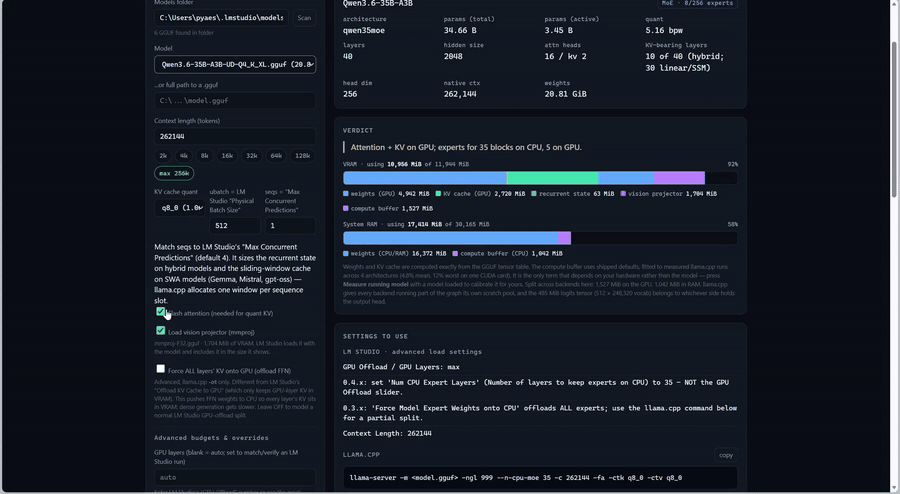
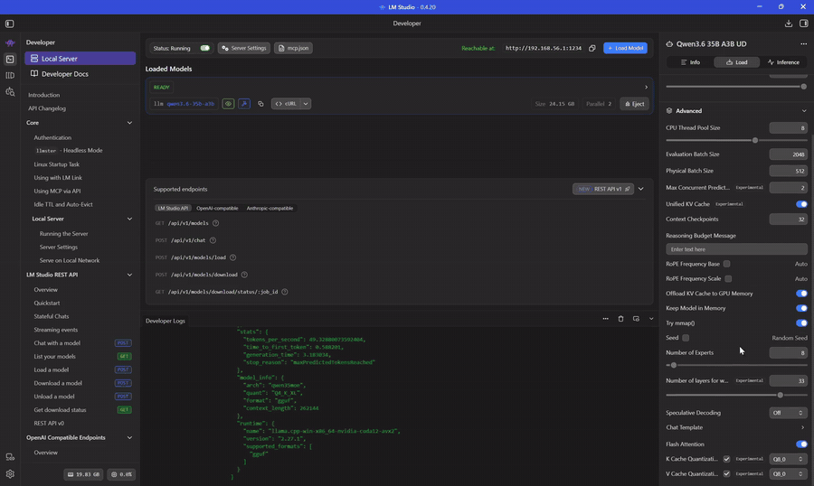

# VRAM Planner

A self-contained Python package (standard library only). It parses any GGUF
**directly** (reads the real byte size of every tensor — the same info as
`npx @huggingface/gguf --show-tensor`, but with no npx/Node dependency), reads
your live free VRAM + RAM, and tells you exactly how a model fits at any context
length and KV-cache quant:

- **Dense models** → how many layers go on the GPU (`-ngl` / LM Studio "GPU Layers").
- **MoE models** → how many layers' experts to keep on CPU (`--n-cpu-moe` / `-ot`),
  keeping attention + router + shared experts on the GPU.
- Max context that still fits fully on the GPU, a KV-cache-vs-context table, and a
  full memory breakdown.
- The one estimated term (the compute buffer) can be re-fitted to **your** machine
  with a `--sweep`/`--fit` harness — see **Measuring it yourself**.

It serves its own web UI, so you never type these commands by hand.

## Demo

**Planning a fit.** A full pass over Qwen3.6-35B-A3B at its 262,144-token context on a
12 GB card — the verdict and memory split, the settings and `llama-server` command, the
KV-cache-vs-context table, the full memory breakdown, and the speed estimate going from
an uncalibrated bracket to a single measured figure:



**Checking it against reality.** The same configuration loaded in LM Studio, with Task
Manager showing what the engine actually allocates:



## Supported platforms

| | status |
|---|---|
| **Windows + NVIDIA** | validated — all measurements below were taken here |
| **Linux + NVIDIA** | should work (`nvidia-smi` + `/proc/meminfo` paths exist), untested |
| macOS / Metal | **unvalidated** — the tool warns and keeps running |
| AMD / ROCm, Intel | **unvalidated** — same warning |

The split matters because only *part* of the tool is hardware-dependent. Weights, KV
cache, recurrent state and the projector are read from your GGUF and are exact
everywhere. The **compute-buffer estimate** was fitted against CUDA on Windows, and
Metal/ROCm allocate their graphs differently — so on those the total is indicative
until you calibrate it. The tool detects this and says so in the terminal and the UI
rather than quietly reporting a confident wrong number.

Per-process VRAM measurement (the **Measure** button) additionally needs `nvidia-smi`
or Windows GPU performance counters, and reading LM Studio's *resolved* config needs
its Windows log path.

## Requirements
- Python 3.8+ (standard library only — nothing to `pip install`).
- NVIDIA driver on PATH for **live** VRAM (`nvidia-smi`, installed with your driver).
  If it's missing, everything still works — just type your VRAM budget manually.

## Run
```powershell
python -m vram_planner
# or, if that isn't found:
py -m vram_planner
```
Run it from the folder containing the `vram_planner/` package.
A browser opens at http://localhost:8121. Point the **Models folder** at your
LM Studio models dir (defaults to `%USERPROFILE%\.lmstudio\models`), pick a model,
set context + KV quant, and press **Analyze fit**.

Other flags:
```
python -m vram_planner --port 8100 --no-browser
python -m vram_planner --self-test        # validates the parser + math
python -m vram_planner --self-test --require-refs
                                          # ...and fail if a real-load check is skipped
python -m vram_planner --version
python -m vram_planner --sweep --dry-run  # what --sweep would run (see Measuring it yourself)
```

Calibration and benchmark history live in `%LOCALAPPDATA%\vram-planner\`
(`~/.local/share/vram-planner/` elsewhere), not next to the script.

## Layout
Each module imports only from those above it, so the import graph is a DAG and
every number has one home:

| module | what lives there |
|---|---|
| `const` | version, byte units |
| `gguf` | the GGUF binary reader |
| `model` | config extraction, tensor classification |
| `kv` | cache geometry — exact, read from metadata |
| `compute` | the compute buffer — the one fitted term |
| `paths` | user data locations |
| `gpu` | live hardware probes |
| `lmstudio` | models, runtime config, server logs, backends |
| `speed` | bandwidth roofline |
| `calib` | fitting `compute` to this machine's measurements |
| `plan` | `analyze()` and the layer-split planners |
| `sweep` | driving `llama-server` across a config grid, recording what it allocates |
| `fit` | scoring `compute` against sweep data, held out |
| `web` | JSON endpoints and static file serving |
| `ui/` | `index.html`, `app.css`, `app.js` — the front end, as real files |
| `selftest` | synthetic GGUFs and the test suite |
| `cli` | entry point |

`sweep` and `fit` are the evidence base, not part of a plan — nothing above imports
them and the tool works without ever running either. See **Measuring it yourself**.

Three edges run backwards and are imported inside the function that needs them:
`compute.compute_buffer_terms` reads `calib.calib_coeffs`, `calib.record_calibration`
calls `plan.analyze`, and `calib.migrate_calibration` calls it too when re-deriving
stored rows after a schema change. All three are marked at the call site.

`import vram_planner as v` still re-exports the whole public surface, so
`v.analyze()`, `v.load_gguf()` and friends work unchanged.

## Sliding-window attention (Gemma, Mistral, gpt-oss, Cohere2 ...)

Most recent long-context models do **not** grow a full KV cache on every layer. They
interleave a few *global* full-attention layers with many *windowed* ones capped at a
fixed span, and llama.cpp allocates two caches accordingly: a full `n_ctx` one for the
global layers, and a small ring buffer sized by the window for the rest. The windowed
layers also often use smaller head dims than the global ones.

The planner detects this from whatever signal the file carries, most explicit first:

1. `*.attention.sliding_window_pattern` as a per-layer 0/1 list (Gemma 4),
2. `*.attention.layer_types` string list,
3. a stride integer, or `*.full_attention_interval`,
4. `SWA_STRIDE_BY_ARCH` for architectures where llama.cpp hardcodes the stride
   (gemma2/3/3n, cohere2, gpt-oss, llama4, exaone4, hunyuan-moe),
5. an explicit stride of 1 still means "every layer is windowed", and
6. a window declared on an **unknown** architecture with no pattern anywhere is
   **not** assumed to be fully windowed any more — that guess can understate KV by
   10-20x at long context, and this tool's job is to say whether something fits.
   It charges every layer full and reports the window as ignored, so a plan errs
   conservative when the pattern is genuinely unknown.

A file with no window size falls through unchanged. Head dims come from
`key_length_swa` / `value_length_swa` where present.

**This is worth a lot.** Gemma 4 31B at 131k context, KV at q8_0:

| | naive (all layers full) | actual |
|---|---|---|
| 50 windowed layers | 106,000 MiB | ~638 MiB |
| 10 global layers | 8,240 MiB | 5,440 MiB |
| **total** | **114,240 MiB** | **6,078 MiB** |

Because the windowed layers are constant in context length, the KV-vs-context table is
**not a straight line** — past the window, only the global layers grow. Verified
against real llama.cpp: an `-ngl 4 -> 8` step predicted a 1231.8 MiB delta and measured
1232.0 MiB.

## Hybrid (attention + SSM) models
Qwen3.5/3.6 (`qwen35`), Qwen3-Next, Falcon-H, Jamba, Granite-4 and friends only run
**full attention on every Nth block** — the rest are linear/SSM blocks. Only the
attention blocks grow a KV cache with context; the SSM blocks hold a small
**fixed** recurrent state (conv + SSM state, f32, one copy per parallel sequence).

Qwen3.6-27B, for example, is 64 blocks but only **16** of them (every 4th) have KV.
Treating all 64 as KV-bearing overstates the cache by 4x — 17.0 GiB instead of
4.25 GiB at 128k/q8_0. The planner reads which blocks have `attn_k`/`attn_v` vs
`ssm_*` tensors straight from the tensor table, so it gets this right without an
architecture lookup table.

Because blocks are not interchangeable on these models (and llama.cpp offloads the
**last** `-ngl` blocks), the split is computed block by block rather than from a
per-layer average.

## Multimodal models and "why doesn't this match LM Studio's model size?"
Two separate things make the numbers look different:

1. **GiB vs GB.** The planner reports GiB (1024³). LM Studio reports the same bytes
   as GiB in the model panel and as GB (10⁹) in the loaded-models list, both
   labelled "GB". `17,612,564,704 bytes` = **16.40 GiB** = **17.61 GB**.
2. **The projector is part of what LM Studio calls the model.** A multimodal model
   ships `mmproj-*.gguf` next to the weights. LM Studio loads it onto the GPU and
   folds it into the size it displays.

For Qwen3.6-27B-UD-Q4_K_XL:

| | GiB | GB |
|---|---|---|
| `Qwen3.6-27B-UD-Q4_K_XL.gguf` | 16.40 | 17.61 |
| `mmproj-F32.gguf` | 1.72 | 1.84 |
| **bundle — LM Studio's "model size"** | **18.12** | **19.46** |

The planner now finds the sibling projector, charges its **1,758 MiB** to VRAM
before planning the layer split, and shows both the model and the bundle size in
GiB and GB. Untick **Load vision projector (mmproj)** if you run text-only.

## MoE models: two different knobs, and LM Studio may ignore both

- `-ngl N` puts the **last N blocks** on the GPU — attention, KV and experts together.
- `--n-cpu-moe M` moves only the **routed experts of the first M blocks** to the CPU,
  leaving their attention and KV on the GPU. LM Studio 0.4.x calls this
  *"Number of layers to keep experts on CPU"*.

The efficient config is `-ngl 999` plus the smallest `--n-cpu-moe` that fits: experts
are the only weights big enough to be worth moving, and only a few of them run per
token. Whole-block offload is the fallback for when even that won't fit. The planner
searches in that order and sums real per-block expert bytes, not an average.

**LM Studio silently overrides the sliders.** Check
`%APPDATA%\LM Studio\logs\main.log` for `Resolved GPU config options` — the
`Num Offload Layers` / `Num CPU Expert Layers` there is what actually ran. It also
sizes that decision using **8192 tokens**, not your context length:

```
Not using full context length for VRAM overflow calculations due to single GPU setup.
Instead, using '8192' as context length. Original context length: '262144'.
GPU offload layers was adjusted from 'max' to '16' to respect the strict GPU VRAM cap.
```

Put those two resolved numbers into **GPU layers** and **CPU expert layers** under
Advanced to reproduce a run exactly, instead of what the UI displays.

## Generation speed

Token generation is **memory-bandwidth bound**, not compute bound: every token
streams each *active* weight exactly once. So

```
seconds/token = gpu_bytes/BW_vram + cpu_bytes/BW_ram
```

The byte counts are exact (tensor table, `n_expert_used/n_expert` of the expert
weights, plus the KV re-read that grows as the context fills). The bandwidths are
not, so the planner reports a **bracket** until you calibrate it. Peak VRAM and RAM
bandwidth are auto-detected (`nvidia-smi` memory clock × inferred bus width;
`Win32_PhysicalMemory` speed × total data width) and both fields are editable.

The bracket is wide for a reason: scattered MoE expert gathers over system RAM run
far below peak, while contiguous streaming runs near it. One measurement collapses
it. Three sources, in order of usefulness:

1. **Benchmark the loaded model.** Press the button; it runs one short generation
   against `localhost:1234` and reads `tokens_per_second` out of LM Studio's native
   `/api/v0/chat/completions` stats block. Results are appended to
   `speed_history.json` next to the script. **This is the one that works in server
   mode** — if you drive LM Studio from an API client (opencode, Continue, aider…)
   rather than its chat UI, nothing is written to the chat history, so there is
   otherwise no tok/s to mine.
2. **Saved chats** — `~/.lmstudio/conversations/*.conversation.json` record
   `tokensPerSecond`, `numGpuLayers` and the load config per generation. Only
   populated by the in-app chat.
3. **Server logs** — `~/.lmstudio/server-logs` bracket each response with
   `Streaming response...` → `Prompt processing progress: 100.0%` →
   `Finished streaming response`, giving real **prefill vs decode wall times**. The
   succinct log has no token counts so it cannot produce tok/s, but it answers the
   more important question: which half of the pipeline your time actually goes to.

**Prompt processing is not modelled.** It is compute bound rather than bandwidth
bound and needs a device FLOPS figure plus a kernel-efficiency factor that varies
too much to be worth pretending about.

## What is exact vs estimated

**Exact**, straight from the GGUF tensor table and your context / KV quant — no
estimating: **weights**, **KV cache**, the **recurrent state** and the **projector**.
Per-layer offload deltas match llama.cpp to ~0.1 MiB.

**Estimated**: the compute buffer, and only that. The numbers come from llama.cpp's own
allocator — running with `-v` prints `CUDA0 compute buffer size = N MiB`, which is
exact. `python -m vram_planner --sweep` drives `llama-server` across a config grid and
records that line, the per-process VRAM counter, and llama.cpp's own layer placement,
one JSON row per load. The current model is fitted to **146 usable loads over 5 models
and 3 architectures**. Measured that way, the GPU-side overhead:

- **is allocated even at `-ngl 0`**, where not one layer is offloaded. The tool used to
  charge the GPU nothing here, which is exactly what let partial-offload plans
  overcommit and spill into shared memory;
- depends on whether the graph is *split* far more than on how many layers landed on
  the GPU — identical at `-ngl` 0, 1, 2, 4, 7, 8 and 15 on Gemma 4 26B (501.13 MiB every
  time), and smaller once nothing is left on the CPU. A split graph costs more, not less;
- grows linearly in `n_ctx`, **flat — not as a share of the KV cache**;
- grows separately in `n_ctx x n_ubatch` — the f16 attention mask, which fitted freely
  to **1.990 B** and is the one term whose textbook value the data actually confirms;
- carries a large **context-independent** term on MoE models: the routed-expert
  activation scratch, `n_expert_used` copies of the expert FFN activation per ubatch
  token. Adding it is the single change that most improved held-out accuracy;
- costs **more** with a quantised KV cache than with f16, the opposite of what the
  cache sizes do;
- tracks the **full** context, not the per-slot context — worth stating because the
  host-side buffer does the opposite. `CUDA_Host.compute` halves exactly as `--parallel`
  doubles, so llama.cpp sizes *that* one from `n_ctx / n_parallel`. Modelling the device
  side the same way made held-out error worse, so the two really do differ;
- and sits on a floor of **~156 MiB plus a few MiB per resident block** — the bare CUDA
  context, then lazily-loaded kernel modules as layers arrive. The 156 is the most
  reproducible number here: 155.9 to 156.6 MiB at `-ngl 0` across all five models.

That floor is invisible to the allocator log, so it comes from the process counter
instead. The log fixes the slopes exactly; the perf counters fix the floor.

Plus the f32 score matrix when flash attention is **off** — that term alone is ~3.5 GiB
at 64k context on a 32-head model, which is why FA is not optional at long context.

### Accuracy

Every number below is **held out by architecture** — fitted on two architectures and
scored on the third, never on itself. Reproduce with `python -m vram_planner --fit`.

| what | mean | worst |
| --- | --- | --- |
| **total GPU VRAM** (what the planner reports) | **7.6%** | 39.6% |
| the compute buffer alone | 22.5% | 85.6% |
| the floor, in MiB | 17.2 MiB | 226.7 MiB |

The total is uniformly good across all five models — 4.1%, 5.4%, 6.9%, 9.2%, 12.3% —
rather than a mean dragged around by one of them. The worst cases are all tiny-context,
near-zero-offload corners where the whole total is about 1 GiB, so a 200 MiB miss reads
as 20%. The buffer alone scores worse than the total because it *is* a slice of it; the
rest is weights and KV, which are exact.

Earlier versions of this file quoted 2.7% mean / 8.1% worst. That was an **in-sample**
number: the coefficients were fitted on the same loads the self-test then scored them
against, and it also concealed a pair of compensating errors — a floor formula that
charged up to 974 MiB where the floor has never been observed above 463.6, cancelling
against embeddings that were charged to RAM when llama.cpp had put them in VRAM.

A `max()` over candidate peaks was tried, since ggml-alloc reports a peak over the graph
rather than a sum. It fits better in sample and generalises **worse** — 11.7% in sample
against 28.2% held out, where the additive form gets 21.7% and 21.8%. It is not in the
tool because the data does not support it yet, not because it was not tried.

Press **Measure** to pin the machine-dependent coefficients for your card (see below).

- **Parallel seqs** should match LM Studio's "Parallel" / llama.cpp `-np`. It sizes the
  recurrent state on hybrid models and the sliding-window cache on SWA models.
  Note `-np N` divides `-c` per slot, so total KV is unchanged.

## Calibration

Four compute-buffer coefficients are the only numbers here that depend on your
hardware rather than the model — `floor` (MiB of CUDA kernel modules per resident
block), `ctx`, `act` and `nofa`. Rather than ask you to understand them, the tool fits
them from your own runs.

Load a model in LM Studio, press **Measure running model**. The tool reads the engine
process's real VRAM, reads the config LM Studio *actually resolved* (not what the UI
shows — it silently overrides its own sliders), recomputes the exact terms server-side,
and refits.

It only frees as many coefficients as your data can identify — fitting four to one
measurement would be worse than shipping the defaults:

| measurements | what gets fitted |
|---|---|
| 0 | shipped defaults |
| 1 | the floor — MiB of CUDA kernel modules per resident block |
| 3+ spread over **context** | + the ctx slope |
| + varied **ubatch** | + the activation slope |
| + one flash-attention-**off** run | + the score term |

A term unlocks only when the knob it belongs to actually moved, and a fitted slope more
than 10x from the prior, or negative, is rejected in favour of the default. Rows are
keyed by GPU **and** llama.cpp build, so upgrading the backend does not silently reuse a
fit that no longer applies.

## Measuring it yourself

The accuracy numbers above are reproducible on your own hardware, and the model can be
re-fitted to it.

```
python -m vram_planner --sweep --dry-run     # what it will run, and for how long
python -m vram_planner --sweep               # hours; resumable, safe to interrupt
python -m vram_planner --fit                 # the held-out scorecard
```

`--sweep` finds a `llama-server` under LM Studio's `extensions/backends`, launches it
once per config with `-v`, and records the allocator's own buffer sizes, the
per-process VRAM counter, llama.cpp's layer placement and its SWA pattern — one JSON
row per load under `sweeps/`. A config that fails to allocate is recorded as `oom`
rather than dropped; a load taken with the card at the wall, where Windows spills to
shared memory and the counter reports the cap instead of the need, is detected and
excluded from fitting. `--probe MODEL ctx=A,B,C` runs an explicit ladder when something
in the grid does not interpolate.

## Known issues

- **Whether the token embeddings land in VRAM is measured, not understood.** On the
  three dense models swept they do, as soon as `-ngl` is 1, worth 626–843 MiB; on the
  two MoE models they do not. Charging them on dense models only takes the end-to-end
  error from 22.7% to 7.1%, and does it uniformly across all five, so it is clearly the
  right rule for these models — but the *mechanism* is unknown, and five models over
  three architectures is enough to measure the split and not to explain it. This is the
  first thing to re-check against a new architecture. It errs on the safe side for the
  case it is least sure of: over-charging VRAM makes a plan conservative, under-charging
  it makes the load spill.
- **The floor is the weakest term.** ~17 MiB mean absolute error, and the per-block rate
  genuinely differs by architecture (~10 MiB/layer on Gemma 4, ~2.5 on Qwen3.6-35B-A3B).
  It is also the term **Measure** is best placed to pin, being a property of the machine.
- **Non-CUDA backends are unvalidated.** See Supported platforms above.
- **Multi-GPU is not modelled.** `--tensor-split` is ignored; the plan targets GPU 0
  and the tool warns when it sees more than one card.
- **MLA is implemented but unmeasured.** DeepSeek-V2/V3 and Kimi cache a compressed
  latent, not per-head K and V; the width is read from the `attn_kv_a_mqa` tensor. No
  MLA model has been swept, so this is derived rather than validated.
- **Two measured anomalies I could not explain from outside the process.** On
  Qwen3.6-35B-A3B the recurrent state does not scale with `-np`, while Qwen3.6-27B's
  scales exactly as modelled (+88.0 MiB measured vs +87.3 predicted). And on
  Gemma 4 26B under *partial* offload, some blocks show no context-dependent cache
  growth at all. Neither affects full-offload planning, which is what these models are
  normally run with, and both are bounded.

## Tips

- Keep the model inside **dedicated** VRAM. On Windows, spilling past it uses "shared
  GPU memory" (system RAM as VRAM) and is very slow — turn on LM Studio's
  **"Limit to Dedicated GPU Memory"**.
- **KV cache is what grows with context.** If a model won't fit, the KV-vs-context
  table shows exactly what dropping to 8k/16k buys you. Quantizing the KV cache
  (q8_0 = about half of f16) needs **Flash Attention ON**.
- **MoE control in LM Studio moved between versions:** 0.3.x had "Force Model Expert
  Weights onto CPU" (offloads *only* experts — the efficient option). 0.4.x replaced it
  with "Num CPU Expert Layers". For a precise partial split, use the generated
  `llama.cpp` command (`-ngl 999 --n-cpu-moe N`) directly.

## License

MIT — see [LICENSE](LICENSE).
