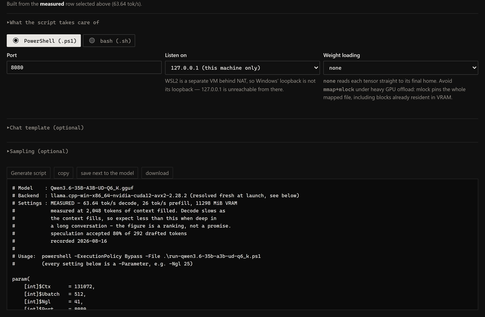

# Command line, and the launch script

Everything the package does without the browser, plus the launcher it writes so a
tuned config survives being closed.

[← back to the README](../README.md)

---

## Command-line reference

Nothing below is required to use the tool — the web UI drives all of it. `--self-test`
is the one worth running after a change.

**Serving and testing**

| flag | |
|---|---|
| `--port N` / `--host H` / `--no-browser` | defaults `8121`, `127.0.0.1`, opens a browser |
| `--self-test` | synthetic GGUFs, the planner math, and every invariant the modules promise |
| `--require-refs` | with `--self-test`: fail rather than skip when a real-load section cannot run |
| `--version` | |

**Allocation sweep** — fitting the compute buffer (see [Measuring it yourself](accuracy.md#measuring-it-yourself))

| flag | |
|---|---|
| `--sweep` | drive `llama-server` across a config grid, recording what it allocates |
| `--dry-run` | with `--sweep`: print the configs and the estimate, run nothing |
| `--models NAME…` | only models whose file name contains one of these |
| `--backend BUILD` | llama.cpp build to drive (default: newest CUDA build found) |
| `--limit N` | stop after this many configs |
| `--sweep-timeout SECONDS` | per-load timeout, default 420 |
| `--probe MODEL AXIS=V,V` | one-off: run named values without recording a campaign |
| `--fit` | score the compute-buffer model against recorded rows, **held out** |
| `--recalibrate` | refit the coefficients from stored rows, save, exit |
| `--show-calibration` | the stored fit and where it came from |

**Speed sweep** — measuring tok/s (see [Measuring speed](speed.md#measuring-speed) and
[docs/speed-sweep.md](speed-sweep.md))

| flag | |
|---|---|
| `--speed-sweep` | drive `llama-server` across a grid, recording how fast it generates |
| `--speed-stages LETTERS` | which stages run, default `acd` — A the wall, C ubatch, D speculation |
| `--speed-mode auto\|speed\|context` | dense only: which question stage A answers — `speed` sweeps context at `-ngl` all, `context` sweeps `-ngl` at a fixed context |
| `--speed-axes AXIS=V,V` | sweep exact values as a cross product instead of the stages |
| `--speed-ctx N` / `--speed-kv TYPE` | freeze context and KV quant for the campaign |
| `--speed-fill TOKENS` | prompt depth to measure at — decode slows as context fills, so this conditions every row |
| `--speed-chain` | build each stage from the previous stage's winner rather than one fixed baseline |
| `--speed-rounds N` | with `--speed-chain`: re-run the stages from the winner |
| `--speed-ot N` | pin the first N blocks' dense FFN tensors to the CPU (`-ot`) instead of the plan mode's every-block pin — dense models only |
| `--speed-spec-kv TYPE` | freeze the draft cache's quant for the campaign (`-ctkd/-ctvd`); f16 by default — q8_0 halves what speculation costs, at whatever the acceptance rate turns out to be |
| `--speed-verify` | after the campaign, load the winner at the production config |
| `--speed-verify-overrides AXIS=V,V` | what "production" means, e.g. `spec=draft-mtp spec_n_max=2` |
| `--n-predict N` / `--repeat N` | tokens per pass (128) and passes per config (3, median) |
| `--chat-template-file PATH` | pin the template — a row measured under another one is a different experiment |
| `--chat-template-kwargs JSON` | template variables, e.g. `{"reasoning_effort":"xhigh"}` |
| `--reasoning {auto,on,off}` / `--reasoning-preserve {default,on,off}` | thinking, and whether it survives the history |
| `--refresh-corpus` | rebuild the frozen filler corpus (see [Measuring speed](speed.md#measuring-speed) before you do) |

**Reading and forgetting**

| flag | |
|---|---|
| `--speed-report` | every recorded row, fastest first |
| `--insights` | with `--speed-report`: what the campaigns *found* instead of the flat ranking |
| `--forget-sweep MODEL…` | forget recorded campaigns — lists what matches, then asks |
| `--yes` | with `--forget-sweep`: skip the prompt |
| `--cards` | list stored model cards |
| `--add-card GGUF…` / `--forget-card NAME…` | record or drop one explicitly |

## The launch script

The payoff of a tuning campaign is a command line, and a command line is the part that
gets lost. The *Launch script* block writes the whole launcher instead — for the row you
pick, or for the planner's predicted split if you have not measured yet, in which case
the script says so in its own header. PowerShell or bash.

It exists because a bare command line walks into seven traps that this repository already
knows about:

- `llama-server` is **not on PATH** — it ships inside LM Studio's backends folder.
- It will not run from that folder alone: the CUDA runtime lives in a separate shared
  *vendor* package, and without it the process dies with `STATUS_DLL_NOT_FOUND`
  (exit `-1073741515`) and **no error message at all**.
- A pinned backend path silently stops existing when LM Studio updates, so the generated
  script resolves the newest build of the same family at every launch — version-aware,
  because by name `2.9.0` sorts above `2.10.0`.
- `--draft-max` was **removed** (it is `--spec-draft-n-max`), and `--no-mmap` / `--mlock`
  are **deprecated** in favour of `--load-mode`. The old spellings are accepted and then
  ignored, which looks exactly like a setting that did nothing.
- `--jinja` has to be passed **before** `--chat-template-file`, or the build accepts only
  its built-in template *names* and rejects a path. It is default-on in current builds and
  was not in older ones — and the backend is resolved fresh at every launch, so that
  default can move underneath you.
- A `--chat-template-file` that does not exist is **not an error**: `llama-server` falls
  back to the template baked into the GGUF without saying so. The generated script checks
  the path and refuses to start.
- Launched directly, `llama-server` logs to the console and nothing is kept.

Flag spelling is not reimplemented: `launch.py` calls `sweep.build_argv(..., probe=False)`,
the same function the sweep uses, minus the three flags that make a run measurable
(`-v`, `--cache-ram 0`, `--no-warmup`) and would be wrong in something you use daily. A
second copy would drift, and the flags most worth getting right are the ones that changed
names. The self-test asserts no generated script ever *executes* a dead flag — reading
what runs, not what the file contains, since naming them in the comments is the useful part.

Sampler fields start blank and emit nothing when left blank. llama.cpp's own defaults
(temp 0.80, top-k 40, min-p 0.05) are not what every model card asks for, so a value
printed there has to be one you chose — and they are *server* defaults, which any client
sending its own overrides per request.

**Chat template.** A template file and `--chat-template-kwargs` can be set alongside the
samplers — a patched tool-call template, or `{"enable_thinking": false}` on a Qwen3. The
kwargs are validated as a JSON *object* when the script is generated, because that is the
difference between a message in the browser and a service that will not come back after a
reboot. Both are emitted as script parameters and assembled **at runtime**, so an empty
value produces *no flag* rather than an empty one — `--chat-template-file ''` is an error,
not a no-op. Note the key names belong to the template, not to llama.cpp: `enable_thinking`
is Qwen3's spelling and is *ignored, not rejected*, by a model that does not use it, so a
typo is silent.

## Tips

- Keep the model inside **dedicated** VRAM. On Windows, spilling past it uses "shared
  GPU memory" (system RAM as VRAM) and is very slow — turn on LM Studio's
  **"Limit to Dedicated GPU Memory"**.
- **A vision model that fits can still OOM on an image**, and *whether the tower fuses
  attention decides by how much*. Unfused, the encoder is quadratic in pixels — the
  score matrix is `n_head × n_patches²`, and a 2560×1600 screenshot at 16px patches is
  16,000 patches, several GiB. Fused, that term vanishes and the same image costs a few
  hundred MiB. On Qwen3.6-27B the planner brackets it at **342 MiB fused vs 15,967
  unfused — a 47× swing**, which is the entire uncertainty in the estimate.
  `clip.cpp` resolves `CLIP_FLASH_ATTN_TYPE_AUTO` by probing the backend, not by model,
  so read your load log's `flash attention is enabled/disabled` line rather than
  guessing. On CUDA it is normally enabled: the SigLIP tower these models share is head
  dim 72, which `fattn.cu` supports, though only off the tensor-core path.
- **Image tokens are a context cost, not just a VRAM one.** After the spatial merge a
  2560×1600 image is 4,000 tokens — an eighth of a 32k context per screenshot, with the
  KV and prefill to match. Downscaling to ~1024px on the long edge cuts that to 640 and
  is the cheapest fix available whether or not attention is fused.
- **KV cache is what grows with context.** If a model won't fit, the KV-vs-context
  table shows exactly what dropping to 8k/16k buys you. Quantizing the KV cache
  (q8_0 = about half of f16) needs **Flash Attention ON**.
- **MoE control in LM Studio moved between versions:** 0.3.x had "Force Model Expert
  Weights onto CPU" (offloads *only* experts — the efficient option). 0.4.x replaced it
  with "Num CPU Expert Layers". For a precise partial split, use the generated
  `llama.cpp` command (`-ngl 999 --n-cpu-moe N`) directly.
