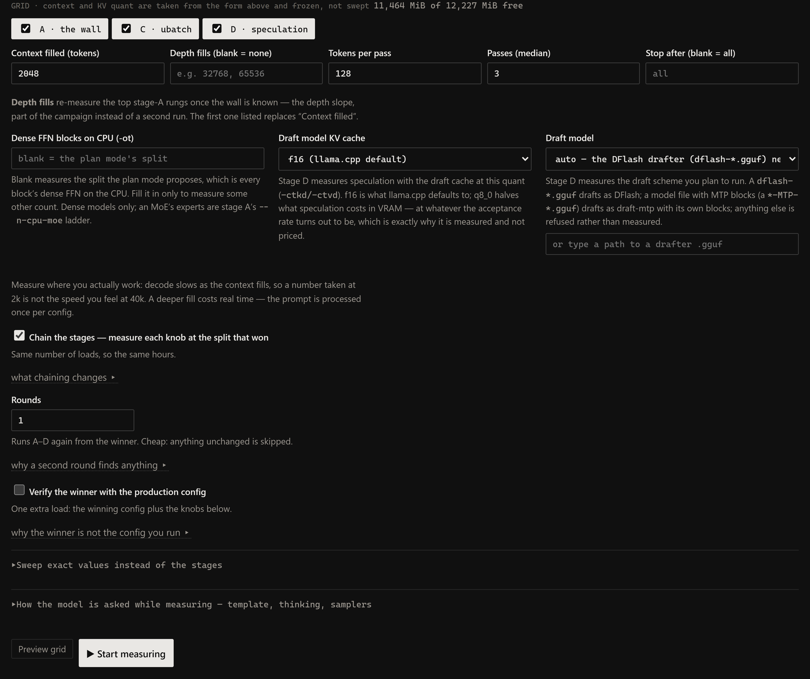
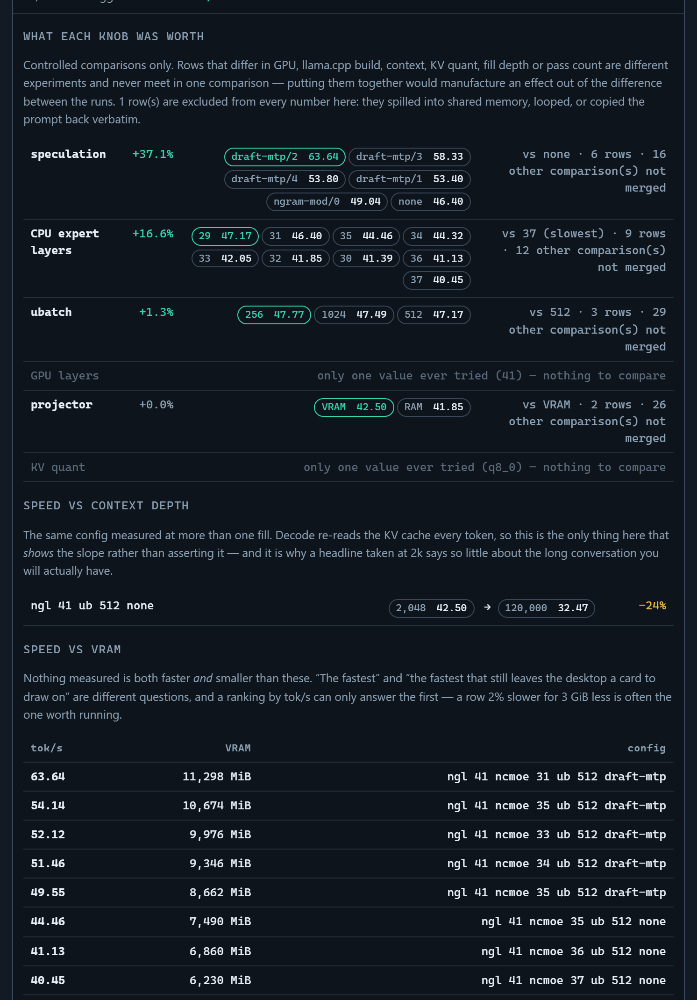

# Running a speed sweep

`--sweep` answers *"does this config fit, and what does the allocator reserve for it"*.
This is the question left over: **of the configs that fit, which one is fastest** — and it
cannot be derived from the memory model, because the two settings most worth tuning are
invisible to it.

- **Speculative decoding.** `speed.py` is a bandwidth roofline with no acceptance-rate
  term, and `per_token_bytes()` skips MTP blocks because they do not run during ordinary
  decode. The planner can price what speculation *costs* — a draft cache, quant and all
  (llama.cpp keeps it f16 whatever `--cache-type-k` says; the campaign can pin it lower
  with `--speed-spec-kv`, §5.1) — and nothing of what it saves. On one 27B hybrid the
  roofline predicted MTP would **lose 4%**; measured, it **won by 41%**.
- **Prompt processing**, which is not modelled anywhere in this tool, on purpose.

Everything below is a real command. The same harness also runs from the web UI — see
[§2](#or-from-the-browser) for the mapping and [§11](#11-the-launch-script) for turning a
result into something you can launch — but nothing here *requires* it.

---

## 1. Before you start

**The GPU must be free.** `preflight()` refuses to run if less than 85% of VRAM is
available, because a resident model does not make a sweep *fail* — it makes every row
wrong in the same direction, which is worse, since the numbers still look like numbers.
Close LM Studio, stop any `llama-server` you launched yourself.

> `--dry-run` skips preflight. It is safe to plan a sweep while something is loaded; it
> is not safe to run one.

You also need a `llama.cpp` build. The sweep finds one under LM Studio's
`extensions/backends`, newest CUDA first, and puts its shared vendor package on `PATH` —
without which the binary dies with `STATUS_DLL_NOT_FOUND` and no message at all.

```
python -m vram_planner --speed-sweep --models MODEL --dry-run
```

Always dry-run first. It prints every config and a time estimate, and runs nothing.

---

## 2. Quick start

```
# plan it
python -m vram_planner --speed-sweep --models Qwen3.8 --speed-ctx 131072 --speed-kv q8_0 --dry-run

# run it (hours; resumable, safe to interrupt)
python -m vram_planner --speed-sweep --models Qwen3.8 --speed-ctx 131072 --speed-kv q8_0

# read it back, fastest first
python -m vram_planner --speed-report
```

Rows are appended one at a time and flushed, and any config already recorded is skipped,
so an interrupted sweep resumes where it stopped.

### …or from the browser

`python -m vram_planner`, analyse a model, then open **step 2 · Measure real speed**. It
drives the same harness, so everything in this guide still applies — the differences are
only in the driving:



| | CLI | browser |
|---|---|---|
| context / KV quant / ubatch | `--speed-ctx`, `--speed-kv`, `--speed-ub` | taken from the form and frozen |
| stages | `--speed-stages ab` | tick boxes |
| preview | `--dry-run` | **Preview grid** |
| progress | printed rows | live table, ordered as measured |
| stopping | Ctrl-C | **Stop**, which lands between configs |
| skipping one run | press **S** | **Skip run** (§3.3) |
| chaining | `--speed-chain`, off by default | **Chain the stages**, ticked by default |
| rounds | `--speed-rounds N` | the **Rounds** field |
| reading back | `--speed-report` | **Measured results**, the ranked table |
| findings | `--speed-report --insights` | **Past sweeps**, expandable per campaign |
| forgetting a campaign | `--forget-sweep MODEL` | **✕** on a Past sweeps row (§12) |
| the payoff | copy the flags by hand | **step 3 · Launch script**, §11 |

Three things the browser does that the CLI does not. It refuses to start while anything
else holds the GPU and *names the process*, rather than printing a number you have to
interpret. **Stop** finishes the config in flight before ending, so its row is complete
rather than half-written — which costs up to a couple of minutes and loses nothing,
because rows are keyed and restarting resumes from there. And the **recommendation card**
at the top of the page reconciles whatever this campaign measures against the planner's
own estimate, naming every reason the two differ — the objective, the VRAM budget each was
priced against, and the knobs (`ub`, `spec`, projector placement) that no plan can predict.

**Past sweeps needs none of this.** It reads campaigns already on disk, so it is what the
page shows before you have analysed anything, and every one of its rows can be turned into
a launch script without a model being loaded or a GPU being touched.

---

## 3. Two stages

| stage | what it answers | how |
|---|---|---|
| **A** | the wall, and then what the wall left over | two **bisections**, phase 1 then phase 2 |
| **B** | which draft scheme and depth is fastest at what A found | the full spec list, ranked by tok/s |

Stage A comes first because every later comparison is meaningless at a config that
spills, and stage B needs A's answer settled before it can measure anything at it.

### Stage A, phase 1: the mode's own axis

Which knob the wall is made of depends on the question being asked (`--speed-mode`, §5):

| model / mode | pinned | phase 1 searches | the wall is |
|---|---|---|---|
| dense, `--speed-mode ceiling` | `-ngl` all, `-ot` all blocks | **context** | the largest window that loads |
| dense, `--speed-mode fit` | context, `-ot` all blocks | **`-ngl`** | the most blocks that load |
| MoE | `-ngl` all | **`--n-cpu-moe`** | the smallest expert offload that loads |

**"Loads" means `status: ok` and nothing else.** Not fastest, not "fast enough", not
"loaded and did not look suspicious" — it came up and produced a measurement. An `oom`
did not fit; neither, for the search's purposes, did a `genfail`, a `timeout`, or a
config you **skipped**. A bisection needs an answer for every rung, and that is the safe
one: it keeps more exiled and less allocated, and it is the reason a config you judged
once can never come back as the winner.

### Stage A, phase 2: spend what is left

If phase 1 **topped out** — the largest value in the whole range loaded, so the axis ran
out of room to spend VRAM on before the card ran out of VRAM — then there is VRAM left
over, and on a dense model it buys FFN blocks back onto the card. Phase 2 bisects
`n_cpu_ffn` downward from a full exile and promotes the **smallest exile that still
loads**: the most FFN kept in VRAM.

A winner in the *middle* of phase 1's range means the wall is real and nothing is spare,
so phase 2 does not run — walking the FFN back on there would only re-prove the same wall
one knob over. There is no phase 2 on an MoE either: `--n-cpu-moe` *is* its dense-FFN
knob, and phase 1 has just searched it.

### Why a bisection, and not a ladder

Finding a wall on an axis that is monotone in VRAM is a search problem, and the ladder
was the wrong algorithm for it. Two things change:

- **Cost.** A ladder pays one load — about two minutes — per rung. A bisection pays
  `ceil(log2(n))`: 66 layer counts cost **seven** loads, where the old nine-rung bracket
  cost nine and covered a seventh as much.
- **Correctness**, which matters more. Because a bisection can *afford* the whole range,
  it no longer matters whether the planner centred a bracket well. A wall more than a few
  rungs above the seed used to sit outside the ladder entirely, and the campaign would
  then report the top of its own bracket as the wall, with nothing in the output to say it
  had never looked further up.

`plan.analyze()` is still asked where the split falls, but only for the **pins** — which
axis is free and what the others are held at. Where the wall *is*, is now measured.

Context is the one axis with no natural unit, so its domain is multiples of
`n_ctx_train / 64`, never finer than 1024 tokens. That is 4096-token rungs on a
262144-trained model and 1024-token rungs on a 32768-trained one — far finer than anyone
tunes at, and seven probes either way.

**A probe already on disk costs nothing.** Before issuing one, the search looks the config
up in the campaign's recorded rows; a hit feeds the stored status straight in without
loading anything. So a resumed campaign, and a second `--speed-rounds` pass, replay the
whole search for free and reach the same winner — which is also what keeps the search
reproducible across restarts.

**Stages C, E and the old B were retired.** The old B swept the projector's placement,
which is a decision rather than a measurement: say where it goes on the plan form and both
the plan and the campaign use that. **C** swept `-ub`, which is a *prefill* knob — this
tool's own insights put the whole ladder at **+1.3%** against +37% for speculation (§8.1),
so it was spending four loads an hour apiece to re-derive that. It is frozen from the form
now, like context and KV quant, and `--speed-ub N` sets it from the CLI; sweep it by hand
with `--speed-axes "ub=256,512,1024,2048"` if you want the number again. **E** swept the
dense-FFN `-ot` pin from a planner seed; phase 2 answers the part of that which was a real
question. `--speed-ot N` still pins some other count by hand.

**D was renamed B.** With C gone the campaign is A-then-speed, and a letter that skips two
places reads as two stages that failed to run. `--speed-stages d` still works and says so;
rows already on disk keep the letter they were measured under, because the resume key
never included the stage and rewriting history to tidy a label is not a trade worth
making.

**Depth is not a stage.** It is the `--speed-fill` axis, and it matters more than any
single setting (see §8). Run the top two or three configs again at a realistic fill:

```
python -m vram_planner --speed-sweep --models MODEL --speed-fill 32768 \
    --speed-axes "ngl=28 spec=draft-mtp spec_n_max=2 mmproj_offload=0"
```

`--speed-fills` makes that part of the campaign instead of a second run: the first value
is the campaign fill, and each extra value re-measures the **top three stage-A rungs** at
that depth, right after stage A finds the wall:

```
python -m vram_planner --speed-sweep --models MODEL --speed-fills 2048 32768 65536
```

It works because the wall does not move with fill: the allocation is decided by the
frozen context at load time, and fill only decides how much of it is used. So the deep
rows skip the wall stage A already paid for — the rungs they use are exactly the ones
that fit. The rows are keyed on fill, so they never compete for the chained baseline: a
2k row and a 32k row are different experiments by design (§3.1).

### 3.0 Monotone walls: the grid prunes itself

A hard `oom` is monotone evidence: the config that hit it and the queued configs that
are *worse* on the same axis, with every other knob equal, fail the same way — loading
them would re-prove the wall instead of measuring anything.

That is the same fact stage A's bisection is built on — if a value loads, every cheaper
value loads — used to *choose the next probe* rather than to discard queued ones. A
search has no queue to prune, so the pruning below is what stage B's depth ladder and an
explicit `--speed-axes` ladder get instead:

```
wall    : ngl 42 ncmoe 0 ub 512 spec none OOMs; 5 later configs provably worse, skipped
```

- **Only `oom` prunes.** A `genfail`, `exit` or timeout says nothing about the next rung;
  a `spilled` row *loaded* (and ran badly), which is a measurement, not a wall.
- **Only along monotone axes.** `ngl`, `ub`, `ctx` and draft depth only ever cost more
  VRAM as they rise; `n_cpu_moe` (MoE models) and `n_cpu_ffn` (dense models) only ever
  cost less as they rise. A
  ladder over `spec` or `temp` has no ordering, so those rows are all measured, exactly
  as typed — including in `--speed-axes` ladders.
- **Pruned rows are never recorded**, so a campaign resumed after a card change
  re-measures them naturally. The OOM row itself stays: it is the wall the ladder is
  read from.
- The **dry-run counts are therefore an upper bound** on what a run measures, and the
  hour estimate is the most pessimistic reading of it.

---

## 3.1 Chaining: stop measuring at a baseline nothing confirmed

Without chaining, stage B is pinned at **the planner's** split, not at the one stage A
found. That is not an oversight — nothing can know stage A's result before stage A has
run — but it means speculation gets measured at a split you have no evidence for. The
historical fix was to re-run by hand with `--speed-axes` at the previous winner.

```
python -m vram_planner --speed-sweep --models MODEL --speed-chain
python -m vram_planner --speed-sweep --models MODEL --speed-chain --speed-rounds 2
```

Stage B is built *after* stage A finishes, from the winner stage A actually measured.
**The number of loads does not change**, so neither do the hours: this is the same search
with the baseline kept honest, not a wider one.

Stage A's own two phases are chained whether or not you ask for it. That is not chaining —
it is stage A knowing its own answer, and phase 2 has to run *at* that answer or it
measures a config the mode never proposed. What `--speed-chain` decides is whether stage
A's result escapes to stage B.

The log says what each phase decided, including when it decided nothing:

```
stage A: bisecting ctx over 64 values, 7 probes at most, at ngl 52 ncmoe 0 ub 512 spec none ffn-cpu 52
  wall    : ctx: 7 probes, 65536=ok 98304=ok 114688=ok 122880=ok 126976=ok 129024=ok 131072=ok -> 131072
  baseline -> ngl 52 ncmoe 0 ub 512 spec none ffn-cpu 52   (largest ctx that loads: 131072, 9.35 tok/s, stage A)
stage A: ctx fits whole, so there is VRAM left - bisecting n_cpu_ffn over 53 values, 6 probes at most
  wall    : n_cpu_ffn: 6 probes, 26=oom 39=ok 33=ok 30=ok 28=oom 29=oom -> 30
  baseline -> ngl 52 ncmoe 0 ub 512 spec none ffn-cpu 30   (smallest n_cpu_ffn that loads: 30, 9.35 tok/s, stage A)
stage B: 19 configs at ngl 52 ncmoe 0 ub 512 spec none ffn-cpu 30
  baseline unchanged: nothing beat 9.35 tok/s by more than 2%
```

The `wall :` line is the whole search: every value probed, what it did, and what that
converged on. The parenthesis names the criterion that chose the row, because it is not the
same one at both stages.

**What "best" means is the stage's own question**, not one rule for the whole campaign:

| stage | promotes | why |
|---|---|---|
| **A** phase 1 | the value at the **wall** — largest `ctx` (ceiling plan), largest `-ngl` (fit plan), smallest `--n-cpu-moe` (MoE) | the axis is monotone in VRAM, so the value at the wall is the one worth having |
| **A** phase 2 | the **smallest `-ot` exile** that loads | fewer FFN blocks in RAM is more resident, and phase 1 proved there was room |
| **B** | the **fastest** row, by more than 2% | a draft scheme's worth is its acceptance rate, and no ordering of depths implies it |

Stage A used to rank by tok/s like stage B, and on the ceiling plan that was actively wrong.
Decode re-reads the KV for the tokens actually **present** (`fill`), not for the window
that was *allocated*, so tok/s across a context ladder is nearly flat — measured rows on a
27B dense model move **4.2% across a doubling of context**, and downward. Fastest-wins
therefore promoted the *smallest* window on the ladder, giving up half the context for 4%
of speed, in the one mode whose entire headline is "the largest context that still fits".

**Stage A has no slack.** There used to be a 5% one: a rung running below the fastest rung
on its ladder was dropped before the extreme was taken. It is gone, and stage A now means
exactly what it says — the largest value that **loaded**, even when that value is the
slowest row measured. A big window measured a little slow is still the big window that
fits; refusing it because a smaller rung read 6% faster hands back the window to buy a
difference the same ladder produces as jitter.

What the slack was really guarding against — a rung that loads and then thrashes because
WDDM spilled it into shared memory — is a **spill**, and there are three detectors for it
(§8, Statuses) that answer from the memory counters instead of inferring it from a speed
ranking. Stage B still gates on them, because stage B reads tok/s. Stage A deliberately
does not: "did it load" is a question a spilled row answers yes to, and truthfully.

Which end of an axis is the good end comes from one lookup, `bench.axis_direction()`, over
the same tables the OOM pruning walks — so the search domain, the promotion, the draft
retry walk and the recommendation card cannot disagree about it. `-ot` and `--n-cpu-moe`
are the two that run **downward**: they measure how much has been *exiled*, so fewer blocks
moved off the card is more resident and the wall is the minimum. The search expresses that
by ordering its domain **ascending in VRAM cost** and always looking for the highest index
that loads, so all four axes are one question and cannot be answered inconsistently.

**The recommendation card ranks the same way.** `recommend.recommend()` asks `mode_axis()`
which knob the category on screen leaves free and hands the surviving rows to the same
`bench.pick_extreme()` the stages promote with — so "the best measured config" on the plan
page and the config a campaign would carry forward are the same row by construction, not by
two places agreeing to rank the same way. Outside the two-plan regime the card falls back
to fastest-wins, because nothing has been left free.

Three rules make it safe:

- **Only what was measured under the same conditions competes.** Same model, GPU, backend
  build, context, KV quant, ubatch, draft-cache quant, fill depth, sequences, flash
  attention, samplers, chat template, prompt corpus, `n_predict` and `repeat`. A 2k-fill
  row must never set the baseline for a 32k campaign — that is not a slower config, it is a
  different experiment.
  *One exception*: in the dense **speed** mode, context is the axis stage A searches, so it
  stops being part of what the campaign IS and becomes what it found. There — and only
  there — rows at different contexts compete, and the winner's context is carried forward.
- **Spilled and looping rows never carry forward from stage B.** They stay in the table,
  because they are evidence about where the wall is; they just cannot be the thing a speed
  baseline is drawn from, since a bad baseline bends everything after it in one direction,
  silently.
- **A challenger must win by more than 2%.** `tok_s` is a median of `repeat` passes, so a
  1% lead is jitter — and rebasing on jitter would make the campaign explore different
  configs on two runs of the same machine. This applies to stage B, the stage that ranks by
  speed; "which value loaded" is not a speed measurement, so the margin does not gate stage
  A.

What actually carries forward is a fixed set of knobs — `ngl`, `ncmoe`, `n_cpu_ffn`, the
projector's placement and the speculation triple (`spec`, `spec_n_max`, `md`) — plus `ctx`
in the ceiling plan. Everything else a row carries is the campaign's *definition* rather than
its result, and a stage that changed one of those would be answering a different question
than the one being asked. **`ub` moved across that line when stage C was retired**, and it
had to move in both lists at once: out of what carries, and into what a comparison gates
on. Doing half of it would have let the ub-1024 rows every old stage C left on disk set the
baseline for a campaign frozen at 512.

The baseline is re-read **from disk**, not from memory, so a campaign stopped after stage A
and restarted tomorrow recovers stage A's winner instead of falling back to the planner.

`--speed-rounds N` re-runs the stages from the winner. It is close to free: the resume key
does not include the stage letter, and a search probe whose config is already recorded is
answered from disk without loading anything — so a second round replays stage A's entire
bisection at zero cost and only pays for combinations round 1 never tried. A second round
is worth it mainly when speculation wins in stage B: the draft cache costs VRAM the planner
priced under different assumptions, so the wall genuinely moves.

A dry-run can only list **stage B's** configs, and only when nothing is chained. Stage A is
a search, so its values are decided as it goes and printing any of them would be a guess
dressed up as a plan. Its *count* is exact — `ceil(log2(n))` does not depend on where the
wall turns out to be — so the hour estimate is not a guess. It is an upper bound in one
place: phase 2 is counted as though it will run, because whether it runs cannot be known
until phase 1 has.

## 3.2 The verify row: measure what you will launch

The sweep's winner is one point in a search, and its knobs are rarely what you actually
run — production usually adds MTP draft depth, different ubatch, a sampler. Those change
the allocation the sweep never saw (MTP's draft cache alone moved the OOM wall one `ngl`
rung in on one model). `--speed-verify` closes that: after the sweep finishes it loads the
winner **plus** the config you pass with `--speed-verify-overrides` (same
`k=v` grammar as `--speed-axes`) and records one more row, under the same `prompt_id`.

```
python -m vram_planner --speed-sweep --models MODEL \
    --speed-verify --speed-verify-overrides "spec=draft-mtp spec_n_max=2"
```

It is a second opinion on the winner, not a replacement for it: the verify row lands in
the same table and the report flags it. If it is untrustworthy — OOM at the winner's
`ngl`, or the model loops/copies at that depth — the winner stays, but the log says what
you will actually get when you press the launch button, which is the number that
matters. Budget ~2 minutes (one load) per campaign.

## 3.3 Skipping one run without stopping the campaign

Most of a config's wall time is one blocking request to the server, so a server that
wedges sits out the whole generation timeout — up to 30 minutes per config, and the
only escape used to be stopping the sweep entirely. **Skip** is the escape from ONE
run: press **S** in the terminal (or the **Skip run** button in the browser), and the
server is killed, the run fails at once, and the sweep moves on to the next config.

A skipped row is recorded with status `skipped` — that is the point, not the cost:

- **It keys, so it is never re-measured** — by this campaign, or by one resumed
  tomorrow. The user already judged it once; making it pay for that judgement twice
  is exactly what the skip exists to prevent.
- **It is never a measurement.** `skipped` rows carry no tok/s, no wall (only
  `oom` prunes), no chained baseline, no insight — the report treats them like the
  failures they replaced.
- **The press binds to the run it was made during.** A press that lands between
  configs kills nothing and consumes itself; the next config is untouched.
- **A completed row is never overwritten.** If the press lands as the run finishes,
  the row stays what it measured — including an OOM row, which is the wall the
  ladder is read from.

Skip is judgement, so use it for "this is not going to work". If a config merely
needs a re-try, stop and resume instead — stopping is the escape from the campaign,
and nothing is lost either way because every row is already on disk and keyed.

The machine makes the same judgement itself, automatically: a pass that runs at a
**fraction of what this model normally delivers** is not a slower config, it is a
card that stopped being usable — WDDM spilled the process into shared memory, or the
machine is busy with something else. The measurement is then **aborted** instead of
crawling through its remaining passes, and the row is recorded with status `spilled`
(§8, Statuses): same keying, same never-a-measurement rule, judged by the machine
rather than by you.

---

## 4. Freezing settings vs chasing speed

**Frozen** — you have non-negotiables (a context length, a KV quant):

```
python -m vram_planner --speed-sweep --models MODEL --speed-ctx 131072 --speed-kv q8_0
```

`--speed-ctx` is clamped to the model's trained context, so it can never ask for more
than the file supports. Both values are printed on every dry-run line, because a frozen
setting that silently is not what you think is the failure mode the listing exists to
prevent.

**Unfrozen** — you want the fastest configuration that exists. Then **context is your
biggest lever**, because KV is what crowds layers off the GPU. On one 12 GB card the
planner's split moved from `ngl 25–33` at 131k to `ngl 35–43` at 32k — same model, same
card. Run stage A at two or three contexts, pick the shortest you can live with, then
tune everything else there.

```
python -m vram_planner --speed-sweep --models MODEL --speed-ctx 32768  --speed-stages a --speed-mode fit
python -m vram_planner --speed-sweep --models MODEL --speed-ctx 131072 --speed-stages a --speed-mode fit
```

Quantising the KV cache buys layers the same way (`q8_0` is about half of `f16`) and
needs flash attention, which the grid already has on.

---

## 5. Dense vs MoE — the axis inverts

The harness detects this from the file; you do not pass a flag. But know what changes:

|  | dense | MoE |
|---|---|---|
| phase 1 axis | context or `-ngl`, by `--speed-mode` | `--n-cpu-moe`, at `-ngl` = all blocks |
| better direction | **higher** | **lower** |
| the wall is | the largest value that fits | the smallest value that fits |
| phase 2 | `-ot`, if phase 1 topped out | none — phase 1 already searched the expert split |

`-ngl N` puts the last N blocks on the GPU — attention, **KV** and experts together.
`--n-cpu-moe M` moves only the *routed experts* of the first M blocks to the CPU, leaving
their attention and KV in VRAM. Experts are the only weights big enough to be worth
moving (92% of the file on one 35B-A3B) and only `n_expert_used` of `n_expert` fire per
token — while whole-block offload drags KV to the CPU with it, which is the expensive
thing to lose. **Laddering `-ngl` on an MoE measures the fallback strategy and never
finds the good configuration at all.**

Stage B also skips `draft-mtp` automatically when the file has no `nextn` blocks — there
is nothing to draft from, so those rows would be identical failures. `draft-dflash` gets
the same gate a different way: the scheme lives in a SEPARATE file (`dflash-*.gguf`, whose
architecture is `dflash`) next to the model, so stage B only adds those rows when that
file is present — and it sweeps the drafter's **whole trained block size**, ascending
(from depth 1 to the block), because llama.cpp clamps `--spec-draft-n-max` to it and the
monotone wall (§3.0) prunes the deeper half of the ladder at the first OOM — the draft
cache grows with depth, so depth 8 failing at a split proves depths 9–16 do too.

### 5.1 The draft cache's own quant (`spec_kv`)

The draft cache is **not** the target's KV cache. llama.cpp keeps it at f16 whatever
`-ctk/-ctv` say — it is moved by its own pair, `-ctkd/-ctvd` (`--cache-type-k-draft` /
`--cache-type-v-draft`) — and it is the speculative allocation that grows with draft
depth, so its size is part of what stage B measures. The sweep's knob is `spec_kv`,
frozen like `kv` is and defaulting to f16:

```
python -m vram_planner --speed-sweep --models MODEL --speed-spec-kv q8_0
```

`q8_0` halves the draft cache (34/32 bytes per element vs 2). The planner prices every
speculative scheme at the campaign's quant — the MTP cache, a DFlash drafter's cache,
an external MTP drafter's — and the launch scripts carry `-ctkd/-ctvd` with the value.
It is an axis like any other (`--speed-axes "spec=draft-mtp spec_kv=f16,q8_0"`), so the
report can say what the smaller cache *bought* — and the answer is allowed to be "it
saved VRAM and lost speed", because the acceptance rate is a measurement, not a price.

### 5.2 Dense FFN offload (`-ot`) — what both dense modes are built on

Dense models have two knobs, not one. `-ngl` moves **whole blocks** — attention, KV and
FFN together — which is expensive per token, because every block's KV leaves VRAM with it.
The alternative: keep every block on the GPU and pin the **dense FFN tensors**
(`ffn_gate`, `ffn_up`, `ffn_down`) of the first N blocks to the CPU with llama.cpp's
`--override-tensor` (`-ot`), e.g.

```
-ot "blk\.(0|1|2)\.ffn_(gate|up|down)\.weight=CPU"
```

**Both dense plans pin this at every block in phase 1.** That is the point: FFN weights
are the cheap thing to exile (they stream once per token either way) and KV is the
expensive thing to lose, so exiling the FFN is what buys either the window (ceiling
plan) or the layers (fit plan). The plans then differ only in which of those two is held
and which is solved for.

Because the pin is fixed for phase 1, the old stage E that swept it from a planner seed is
gone. What was a real question in it — how much FFN can come back once the wall is known —
is stage A's phase 2 (§3). The wall along the axis is monotone **downward** (an OOM at 16
blocks pinned proves 8 fails too), which is what lets phase 2 bisect it and what tags an
explicit `--speed-axes` ladder over it.

This is a **tensor** split, so it is also the one knob no layer count can describe — the
speed model prices it the same way the plan does (`n_cpu_ffn`), and the launch script
carries the regex as a parameter (`-OverrideTensor` / `OVERRIDETENSOR`), so which tensors
move is an edit you can make per launch.

Measure some other count with `--speed-ot N`, or sweep it by hand:

```
python -m vram_planner --speed-sweep --models MODEL --speed-ot 8
python -m vram_planner --speed-sweep --models MODEL --speed-axes "ngl=32 n_cpu_ffn=0,4,8,16"
```

Check before you plan a campaign around speculation:

```
python -c "from vram_planner.gguf import load_gguf; from vram_planner.model import extract_config; \
c=extract_config(load_gguf(r'PATH.gguf')); print('MTP blocks:', c['n_mtp_layers'])"
```

If that prints `0`, only the `ngram-*` variants apply (and a DFlash drafter, when one is
present), and they are worth far less.

---

## 6. Flags and axes

### Command-line

| flag | meaning |
|---|---|
| `--speed-sweep` | run the staged grid |
| `--dry-run` | print the configs and estimate, run nothing |
| `--models NAME` | substring match on the file name |
| `--speed-stages ab` | which stages to run (`a` the wall, `b` speculation). The old letters still work: `d` is stage B, `c` was the ubatch sweep and is now `--speed-ub` |
| `--speed-mode auto\|ceiling\|fit` | dense only: which question stage A answers (§5). `auto` is the coverage rule — ceiling ladders context whenever its plan covers the requested context, fit ladders layers otherwise — not the report's faster-at-your-context pick |
| `--speed-ctx N` / `--speed-kv TYPE` / `--speed-ub N` | freeze context / KV quant / physical batch |
| `--speed-fill N` | prompt length to measure at |
| `--speed-fills N N …` | first value = campaign fill; the rest re-measure the top stage-A rungs at deeper fills (§3). Refuses to combine with `--speed-fill` |
| `--speed-axes "k=v,v …"` | explicit ladder **instead of** the staged grid |
| `--n-predict N` / `--repeat N` | tokens per measured pass / passes per config |
| `--limit N` | stop after N configs |
| `--backend BUILD` | pick a specific llama.cpp build |
| `--sweep-timeout SECONDS` | per-load timeout (raise it for deep fills) |
| `--speed-chain` | build stage B against what stage A measured (§3.1) |
| `--speed-rounds N` | with `--speed-chain`: re-run the stages from the winner |
| `--speed-ot N` | pin the first N blocks' dense FFN tensors to the CPU (`-ot`) for the campaign, instead of the plan mode's every-block pin (§5.2). Dense models only |
| `--speed-spec-kv TYPE` | freeze the DRAFT cache's quant (`-ctkd/-ctvd`) for the campaign; f16 by default (§5.1). Halves what speculation costs at `q8_0`, at whatever the acceptance rate turns out to be |
| `--speed-verify` | re-run the winner plus the production config (§3.2) |
| `--speed-verify-overrides "k=v,v …"` | extra knobs for the verify row, same grammar as `--speed-axes` |
| `--refresh-corpus` | regenerate `_corpus.txt` from the current sources (commit it, §7) |
| `--speed-report` | every recorded row, fastest first |
| `--speed-report --insights` | what the campaigns *found* rather than the ranking (§8.1) |

### `--speed-axes` names

Values are comma-separated; multiple axes form a cross product, so keep it small.

| axis | type | notes |
|---|---|---|
| `ctx`, `ngl`, `ub`, `seq`, `ncmoe`, `fill`, `n_cpu_ffn` | int | `seq` is `-np`; `n_cpu_ffn` is the `-ot` FFN pin (§5.2) |
| `kv` | string | `f16`, `q8_0`, … |
| `spec_kv` | string | the draft cache's own quant, `-ctkd/-ctvd`; absent is llama.cpp's f16 (§5.1). Any draft scheme can ladder it: `spec=draft-mtp spec_kv=f16,q8_0` |
| `fa`, `mmproj_offload`, `warmup` | bool | `0`/`off`/`false` are false |
| `spec` | string | `none`, `draft-mtp`, `draft-dflash`, `ngram-mod`, `ngram-cache`, `ngram-simple` |
| `spec_n_max`, `spec_n_min` | int | draft depth |
| `temp`, `top_p`, `min_p`, `rep_pen`, `pres_pen` | float | see §7 |
| `top_k` | int | |

```
python -m vram_planner --speed-sweep --models MODEL \
    --speed-axes "ctx=131072 kv=q8_0 ngl=28 mmproj_offload=0 spec=draft-mtp spec_n_max=1,2,3"
```

---

## 7. Measurement discipline

**This section is worth more than the commands.** Each item below exists because it
produced a wrong answer that looked completely plausible.

### Bracket every campaign with a repeated control

Machines drift. One laptop measured **±7% within a session**, and once returned **0.58
tok/s for a config that had twice measured 5.54** — a 5× collapse that had nothing to do
with any setting. Re-run one identical config at the start and end of a campaign. If the
two disagree by more than a few percent, throw the run away.

Never compare a number from today against one from yesterday. Re-measure the baseline
*in the same session* as whatever you are comparing it to.

### Greedy is speculation's best case

The harness defaults to `temperature 0` so the token stream is reproducible and two rows
differ by the setting under test and nothing else. But llama.cpp accepts a draft token
when the target's own sampled token matches it, and under greedy that comparison is
deterministic. **An acceptance rate measured greedy is an upper bound.**

Measured on one 27B hybrid: greedy showed **+85%** over no speculation; at the model's
recommended sampler settings it was **+41%**. Same hardware, same session. If you care
about speculation, sweep at your real settings:

```
--speed-axes "… temp=1 top_k=20 top_p=0.95 min_p=0"
```

The non-speculative baseline is unaffected by sampling — bandwidth does not care what the
tokens say — which makes it a useful control.

### Check `distinct_ratio` on speculative rows

Every row records a text sample and the fraction of unique 8-word windows in it.
`temperature 0` with `ignore_eos` can put a model in a repetition loop, and a loop is
exactly what n-gram speculation predicts perfectly. On one model the ratio fell from
**1.00** at 32k fill to **0.18** at 64k — where acceptance duly read **100%**. Those rows
flatter speculation and must not be believed.

Healthy prose is near 1.0. Well below that, discard the speculative comparison.

### Check `copyback_ratio` on deep fills

`distinct_ratio` catches looping, and only looping. The second way a model stops
working looks identical to a healthy row: at deep fill it stops generating and copies its
context back verbatim, whose windows are all distinct — a clean **1.00** with acceptance
duly at **100%**. The row is flagged `copyback_ratio` (fraction of the output's 8-word
windows that appear in the prompt); above **0.5** it is excluded and marked `COPYING` at
run time. Two symptoms, one meaning: the model is not doing the work, and whatever
acceptance rate the row reports is the loop or the copy, not the drafter.

The distinction matters because the two gates are complements: a loop repeats a few
windows, a copy produces nothing but distinct ones. Rows recorded before the gate
existed carry no `copyback_ratio`; the campaigns report how many of their rows are
pre-gate, and their deep-fill numbers are not usable for tuning.

### The prompt goes through the chat template

Both degenerate modes above are also a symptom of HOW the model was asked. A raw
continuation — posting to `/completion` with no role markers — hands an
instruction-tuned model a wall of source that happens to end in a sentence, and the
model does the only thing that endpoint asks: it continues the document, echoing the
instruction or copying the source. One 32k campaign lost all 23 of its rows exactly
that way, and every one was gated as degenerate. The prompt is therefore wrapped with
the server's own chat template (`/apply-template`) and measured once so `fill N` still
means N tokens. A build with no `/apply-template` falls back to raw text and **every
such row is marked `RAW`** (the `no template` badge in the browser) — the failure is in
how the row was produced, so it is named even when the output happens to look fine.
Measured at the depth that failed: copyback **0.598 → 0.035**, distinct **0.184 →
1.00**, and the output became an actual analysis. Whether the prompt is templated is
part of the prompt identity, so templated and raw rows never merge.

### Acceptance rate is conditional on having drafted

A drafter that fires rarely and is always right reports 100% acceptance and buys almost
nothing. One `ngram-mod` row showed 100% acceptance while drafting **15 of 128 tokens** —
a 7% gain. Read `draft_n` next to `accept_rate`, never the rate alone.

### Long fills repeat the filler — and the corpus is frozen

The filler prompt is this repository's own README and sources — real prose and code,
because a prompt built by repeating one paragraph hands n-gram speculation a result it
could never reproduce on real work. Past the length of that corpus (~98k tokens) it must
start repeating, and the row is flagged `corpus_repeated`. A repeat is trivially
predictable, so speculative rows above that length are optimistic.

**The corpus is frozen.** Every campaign records a `prompt_id` — the SHA-256 of the
frozen corpus plus the instruction — and rows only resume under their own id. Editing the
sources changes the filler, which silently invalidated every deep fill ever measured
(one edit moved 65,870 → 66,085 tokens at the same fill). Now a campaign that cannot
reproduce its own corpus is a different experiment and refuses to meet old rows. The
copy lives at `vram_planner/_corpus.txt`; regenerate it with
`python -m vram_planner --refresh-corpus` (it prints the before/after id — commit the
file whenever it changes) and expect to re-measure the campaign's deep fills once.
Rows recorded before the id existed carry none; those are pre-freeze and compare only
with each other.

---

## 8. Reading the results

```
st ctx     ngl  ncmoe ot   ub    fill     spec          nmax mmproj |    tok/s   prefill    VRAM accept
B  131072  28   0     0    512   2048     draft-mtp     2    ram    |     9.45     296.9   11410    80%
A  131072  32   0     8    512   2048     none          0    vram   |     8.10     288.4   10120    -
```

| column | meaning |
|---|---|
| `ctx` | the window the row was loaded with — stage A's own axis in the dense ceiling plan, so a search over it reads as a column rather than as one config measured seven times |
| `ot` | blocks whose dense FFN tensors are pinned to the CPU (`-ot`) — every block in phase 1 of either dense plan mode, and whatever phase 2 walked it back to |
| `tok/s` | **median of `--repeat` cache-warm passes** — pure decode |
| `prefill` | from one cold pass, `cache_prompt` off |
| `VRAM` | per-process dedicated VRAM, from the OS counter |
| `accept` | `draft_n_accepted / draft_n`, speculative rows only |

Two passes per config, deliberately: one **cold** pass measures prefill and is discarded
for decode (llama.cpp loads CUDA kernels lazily, so the opening pass pays for machinery
every later pass gets free), then `--repeat` **cache-warm** passes measure decode at the
real context depth. Splitting them is what makes deep fills affordable at all.

### Statuses

| status | meaning |
|---|---|
| `ok` | measured |
| `oom` | did not allocate — a hard upper bound, recorded rather than dropped |
| `exit` / `timeout` | died, or never printed a ready line |
| `genfail` | loaded, then the generation failed — e.g. a draft depth whose context could not allocate |
| `skipped` | abandoned on request — the user judged it, so it is keyed and never re-measured (§3.3) |
| `spilled` | aborted mid-measurement: a pass ran at a fraction of what this model normally delivers — WDDM spilled the process into shared memory, or the card was busy. Keyed and never re-measured, like `skipped`, judged by the machine rather than by you |

`spilled` marks a row that loaded and reported `ok` but was over-committed: WDDM does not
fail an allocation past the dedicated budget — it moves part of the process into system
RAM and carries on, so the load *succeeds* while every token that touches the moved
bytes crosses PCIe. Where possible it is read directly: the row carries `shared_mib`, the
`\GPU Process Memory(*)\Shared Usage` counter sampled while the server is still alive
(`None` means the counters could not be read — never a clean zero). Rows recorded before
that counter existed are covered by `spill_inferred`, deduced from the campaign's own
floors, which hold steady within ~12 MiB rung to rung — a fall past 100 MiB is the driver
moving memory, not allocator noise. The two are different claims and the code treats them
differently: only the **measured** reading gates (excluded from conclusions), while an
inference marks the row as *at the wall* without discarding it — a ladder slowing at its
top rung is the wall being found, and one real campaign's fastest row carried the exact
collapse signature.

There is a third signal, and it catches what the two memory signals cannot: a process
demoted by a **busy machine** shows no excess shared usage and no floor collapse — the
counters never move, the speed does. A row at a fraction of its campaign's own median
tok/s is flagged (`collapse_inferred`, the ratio that triggered it) and excluded like any
other spill — the wall being found moves a ladder by tens of percent, never by 6x.

And since a spilled run is known to be useless before it finishes, it is no longer
*measured* to the end: the first pass that lands at a fraction of what this model
normally delivers (15% of the campaign's own median tok/s — `SLOW_FRAC`) **aborts** the
measurement, and the row is recorded with status `spilled` — the machine's judgement,
recorded and keyed so the config is never re-measured. No reference rows yet (a
first-ever config on a fresh model) means no abort: there is nothing to be judged
against.

### Depth beats every setting

A headline number at 2k fill is the least representative number in the set. From one real
campaign, same config throughout:

| context filled | tok/s |
|---|---|
| 2k | 9.45 |
| 32k | 4.81 |
| 64k | 2.53 |
| 120k | 1.49 |

If you configured a long context you will *live* at depth, so quote yourself the number at
the depth you actually work at. Speculation's advantage decays the same way — +71% at 2k,
+29% at 32k, level by 120k — because as KV comes to dominate decode, the blocks the draft
cache displaced start to cost more than speculation saves.

`--speed-fills` collects this slope inside the campaign (see §3): the rows land as stage-A
rows at the extra fills, next to the search that chose their rungs, so a dry-run count of
stage A is its probe budget *and* the depth rows on top of it — and because the deep rows
are keyed on fill, a rerun at a single fill never pays for them again.

Stage B's draft-depth ladder is measured the same way a hand-run `--speed-axes` ladder
used to be, and the grid's own monotone rule prunes the redundant half of it: on a
dflash drafter the depths run **the full trained block, ascending**, and the first depth
that OOMs at a split proves every deeper one does too (the draft cache grows with depth),
so the walk skips straight to the split that frees room — see the `wall :` log lines.

The `draft-mtp` ladder is **1, 2, 3, 4, 5, 6, 8, 10** — dense where the optimum falls and
sparse in the tail. It used to be 1, 2, 3, 5, which skipped the depth that actually won.

For **`draft-mtp` the depth ladder is not capped** at an external drafter's
`nextn_predict_layers`. `--spec-draft-n-max` is a draft *run length*, not a count of
prediction heads: on gemma-4-12B with an external MTP drafter, depths 1–15 gave fifteen
different results with acceptance decaying smoothly (0.822 at depth 1, 0.540 at 4, 0.215
at 15) and the best throughput at depth 4 — 18% above depth 1. A clamp would have made
all fifteen identical. The cap used to reduce the ladder to a single rung for a
one-nextn-layer drafter, which ended the wall walk the instant depth 1 fitted: the
campaign would spend two loads finding a context where the draft cache fits and then
never measure the depth question it went looking for.

**Which knob "frees room" means** is decided in one place, and the first answer is always
the same: **whatever phase 2 just spent.**

| the config carries | the walk gives back | a rung is |
|---|---|---|
| dense FFN blocks on the card (`-ot` below every block) | **`-ot`** | one more block's FFN back on the CPU |
| …and then, once every block is exiled again | stage A's own axis, below | |
| MoE | `--n-cpu-moe` | one more block's experts on the CPU |
| dense, `--speed-mode fit` | `-ngl` | one fewer block on the GPU |
| dense, `--speed-mode ceiling` | context | a tenth of the window, snapped down to a multiple of 1024 |

Phase 2 exists to spend the VRAM phase 1 left over, on pulling dense FFN blocks back onto
the card. So wherever it ran, those blocks **are** the headroom, in a form that can be
handed straight back — and handing one back costs a few per cent of decode, which is what
buying it was worth in the first place. The context is not cheap in the same way: in the
ceiling plan it is what the campaign went looking for, the number the whole thing reports.

This is not a preference between two levers. On Muse-Glimmer-30B at `-ngl 52`, on a
5070 Ti Laptop with 11.5 GiB free, **one FFN block is ~214 MiB** while **one context rung
at 131072 against a q8_0 cache is ~66 MiB**. The campaign that prompted this walked
context down all seven rungs — 131072 to 62464, less than half the window — freed 463 MiB,
and never fitted the 1556 MiB dflash drafter. Three FFN blocks free more than the entire
context axis can, because that axis caps out at the size of the KV cache and a drafter is
usually bigger. Five would have fitted it. The walk could not have succeeded on the axis
it was walking, and it gave back the answer to fail.

Once every block is exiled again, what is left is exactly the config phase 1 promoted, so
the walk carries on down stage A's own axis from there — the rungs it would have walked
had phase 2 never run, which is where the old walk *started*. In the ceiling plan that is
context, granularly: a tenth per rung is enough that two or three rungs cover a draft
cache of a few hundred MiB against a KV cache of a few thousand, and coarser steps would
hand back gigabytes of window to buy back megabytes. In the ceiling plan `-ngl` itself is
never spent — it is pinned at every block, and that pin *is* the plan.

**There is no rung budget.** The walk goes until a rung fits or the axis runs out — the
only stopping rule that matches the question it is asking. "Does speculation fit anywhere
in this plan" has an answer, and a budget that stops short reports *no* while meaning *I
did not look*.

It was five rungs, then seven, and seven was wrong on the first model that tested it.
Muse-Glimmer-30B's dflash drafter fits at `-ot 34`; the seven-rung walk started at stage
A's winner of 24 and stopped at **31**, three rungs short, having spent every load it was
allowed to conclude the opposite of the truth. No constant could have known where to
stop: that drafter wants ~2 GiB against the 1556 MiB its file suggests, because a
202048-token vocabulary puts ~394 MiB of logits buffer on the card at `-ub 512`.

It is affordable because a rung that OOMs fails during **load** — 11 to 21 s on that
model, not one generated token — so the whole FFN axis is a couple of minutes and the
context axis after it a few more. The loads that cost real time are the ones that *fit*,
and a rung that fits ends the walk. Reaching the end of both axes is itself an answer:
*not at any split this plan can reach*, which is a finding, where a budget running out is
only a gap.

---

## 8.1 What the campaign found



Read from a real 65-row campaign: speculation was worth **+37.1%**, the expert split
**+16.6%**, and ubatch **+1.3%** — which is the whole argument for measuring effects
rather than rankings. The same panel also shows the one config measured at two depths
falling **24%** from 2k to 120k, and the speed-vs-VRAM frontier where a row 2% slower
buys back 3 GiB.

A ranking answers "which config won". It does not answer "what did I learn", and the
second is the one that tells you where the next two hours should go. `--speed-report
--insights` — and the **Past sweeps** card in the browser — derive four things from rows
already on disk, measuring nothing new:

```
python -m vram_planner --speed-report --insights
```

| | |
|---|---|
| **campaigns** | one entry per (model, GPU, backend build), with row counts and dates |
| **what each knob was worth** | best value vs its natural reference, with the effect size |
| **speed vs context depth** | the same config at more than one fill — the slope of §8, measured |
| **speed vs VRAM** | the rows nothing beats on *both* |

The effect sizes are the point, and their correctness rests entirely on one rule: rows are
bucketed by **everything except the axis in question**, plus the model, GPU, backend file,
`n_predict` and `repeat`. Rows from different experiments never meet, because averaging
across a GPU change or a depth change manufactures an effect out of the difference between
the runs rather than out of the knob. Where more than one such bucket exists, the one with
the most distinct values is reported and the others are *counted, not merged*.

Two smaller rules, both learned the hard way in §7:

- Spilled and looping rows are excluded from every conclusion and the count of exclusions
  is printed. They stay in the row table — a spilled row is how you find the wall.
- The speculation axis carries a warning when its rows needed the filler corpus to repeat.
  Speculation drafts from what it has already seen, so repeated text is its best case and
  the gain is an upper bound rather than anything a conversation will give you.

An axis measured at only one value is reported as "only one value ever tried" rather than
dropped. That is usually the most actionable line in the output: `kv` shows up that way
until you actually sweep it, and KV quant is one of the biggest levers there is (§4).

**Speed vs VRAM** exists because "the fastest" and "the fastest that still leaves the
desktop a card to draw on" are different questions, and a ranking by tok/s can only answer
the first. A row 2% slower for 3 GiB less is often the one worth running.

None of this needs a model analyzed or touches the GPU, and any row in it can be turned
straight into a launch script — including for a model that has since been moved or deleted,
in which case the script is still written in full and its header says the path did not
resolve.

---

## 9. Where the data lives

```
%LOCALAPPDATA%\vram-planner\speed\<gpu>__<build>.jsonl     # rows
%LOCALAPPDATA%\vram-planner\speed\deleted\                 # rows removed by --forget-sweep (§12)
%LOCALAPPDATA%\vram-planner\sweep-logs\                    # last load's log, and failures
```

One file per **GPU and llama.cpp build**, which is why a single file holds many
campaigns: a version bump moves these numbers, and merging two builds into one campaign
would hide that, while merging two models into one file costs nothing. §12 depends on
this — forgetting a campaign rewrites its file rather than unlinking it.

**Rows go to `speed/`, never `sweeps/`, and that separation is load-bearing.**
`fit.load_sweep()` globs every `.jsonl` under `sweeps/` and fits anything
`suspect_reason()` accepts. A speculative row would sail through that filter, and
`compute.py` has no term for a draft cache — those megabytes would be absorbed into
`floor` and `ctx` and quietly corrupt every future plan. Verify the boundary holds:

```
python -m vram_planner --fit      # must be unchanged by any speed sweep
```

Resume keys on the full config **and** on `n_predict`/`repeat`, so a quick smoke row at
`--n-predict 32 --repeat 1` is never mistaken for a real measurement.

---

## 10. Troubleshooting

**Every row OOMs.** The ladder is seeded from the planner against *total* VRAM. If real
free VRAM is much lower, something is holding the card — that is what preflight is for.

**A flag seems to do nothing.** Check it is not deprecated. In recent builds
`--draft-max` → `--spec-draft-n-max`, and `--no-mmap`/`--mlock` → `--load-mode`. The old
names are accepted and then **ignored with a deprecation line**, which looks exactly like
a setting that had no effect. Confirm with `llama-server --help` for *your* build.

**`genfail` on deep draft settings.** The draft context allocates its own compute
buffers, which grow with draft depth; depth 5 and 8 failed where 1–3 fitted. Not a bug —
a VRAM ceiling.

**Numbers changed and no setting did.** Re-run your control. See §7.

---

## 11. The launch script

The point of all this is a command line you can live with, and the **Launch script**
block writes the whole launcher — for the row selected in the ranked table, or for the
planner's predicted split when nothing has been measured yet, in which case the script's
own header says `PREDICTED by the planner, not measured`.

A measured script carries its evidence in the header: decode and prefill rates, VRAM, the
acceptance rate with its denominator, the **fill depth it was measured at**, and a
`SPILLED` warning if that row was over-committed. That last group matters most — a
generated script that claimed 11 tok/s without saying it was measured at 2,048 tokens of
context would be repeating the exact mistake §7 exists to prevent.

Choose PowerShell or bash; the native one for your machine is preselected.

### What it handles for you

| trap | what the script does |
|---|---|
| `llama-server` is not on PATH | resolves it under LM Studio's backends folder |
| CUDA runtime lives in a separate *vendor* package; without it the process dies with `STATUS_DLL_NOT_FOUND` (exit `-1073741515`) **and no message** | reads the backend manifest and puts every vendor directory on `PATH` / `LD_LIBRARY_PATH` |
| a pinned backend path silently stops existing when LM Studio updates | matches the backend *family* and picks the highest version — version-aware, because by name `2.9.0` sorts above `2.10.0` |
| nothing is logged when launched directly | `--log-file` with a dated name per launch (llama.cpp does not rotate it) |
| `--draft-max` removed, `--no-mmap`/`--mlock` deprecated | emits `--spec-draft-n-max` and `--load-mode` |
| `--jinja` must precede `--chat-template-file`, or only built-in template *names* are accepted | emits `--jinja` first whenever a template is set |
| a missing `--chat-template-file` is **not** an error — llama-server silently falls back to the GGUF's own template | checks the path and refuses to start |
| no backend installed at all | falls back to a `llama-server` already on `PATH` |

Every setting is a parameter, so you can override without regenerating:
`-Ngl 25` in PowerShell, `NGL=25 ./run-model.sh` in bash.

### Two defaults worth knowing

**`--load-mode none`**, not llama.cpp's `mmap`. Measured at 13.81 GiB resident versus
17.94 GiB for `mmap+mlock` on a 9.5 GiB working set: mlock pins the whole mapped file
*including the blocks already resident in VRAM*. Right for CPU-only inference, wasteful
under heavy GPU offload. Plain `mmap` is lower pressure still, but those pages are
file-backed and can be evicted, which is what makes decode stutter late in a session.

**Sampling is blank.** No sampler flags are written unless you fill the fields in. A
made-up default is worse than none, because llama.cpp's own (temp 0.80, top-k 40,
min-p 0.05) are not what every model card asks for. Whatever you do set becomes a
*server* default: any client that sends its own values — Open WebUI, aider, most chat
UIs — overrides them per request.

**"Based on" does not mean "equal to".** When you launch from a measured row, the script
states the row's tok/s and evidence — but the config you actually launched is what you
have in the form, and the two can differ (the form's `spec` is set to `draft-mtp`, the
row was measured with `none`; the row's `ngl` was safe *without* MTP's draft cache). The
script says so out loud:

```
# based on M.gguf 9.45 tok/s @ ngl 28 ctx 131072 q8_0 (stage B, 2026-08-10)
# !! this config DIFFERS from the measured row: spec none->draft-mtp
```

Everything under it is still generated — these are the knobs the sweep proved, and you
are running them with production changes on top. But the stated tok/s belongs to the row
as measured, so the mismatch is printed, not hidden. Evidence knobs (`ctx`, `kv`, `ngl`,
`ncmoe`, `mmproj_offload`, fill depth) and samplers (`temp`, `top_k`, `top_p`, `min_p`,
`rep_pen`, `pres_pen`) each warn under their own group of names; every *other* setting —
host, port, template — is yours and never compared.

### Chat template

`--chat-template-file` and `--chat-template-kwargs` are set in the same block as the
samplers, and behave the same way: blank writes nothing at all.

```powershell
-ChatTemplateFile 'C:\models\qwen3-tools.jinja' -ChatTemplateKwargs '{"enable_thinking":false}'
```
```bash
CHATTEMPLATEKWARGS='{"enable_thinking":false}' ./run-model.sh
```

Four things worth knowing:

- **The kwargs are validated as a JSON *object* when the script is generated.** Not a
  list, not a bare scalar. llama-server does not find out otherwise until it is starting
  up, and the difference between a message in the browser and a service that does not come
  back after a reboot is exactly this check.
- **The key names belong to the template, not to llama.cpp.** `enable_thinking` is Qwen3's
  spelling. A model that does not use that variable *ignores* it rather than rejecting it,
  so a typo here is silent — there is no preset list offered because there is nothing to
  verify it against.
- **The flags are assembled at runtime**, not written into the command. `--chat-template-file ''`
  is an error, not a no-op, so an empty parameter has to produce *no flag* — the same
  pattern `--log-file` already uses.
- **Windows PowerShell 5.1 drops the quotes.** Building a native command line, it
  re-quotes each argument and does *not* escape double quotes already inside a value, so
  `{"a":1}` reaches the exe as `{a:1}` and llama-server answers with
  `parse error at line 1, column 2 ... last read: '{e'` — which points at your JSON when
  the JSON was never the problem. The generated script escapes them as `\"`, and skips
  that under PowerShell 7.3+ (`$PSNativeCommandArgumentPassing`), where the argument is
  passed through intact and the backslashes would arrive literally. bash needs none of
  this: `execve` takes argv directly and nothing re-parses it.
- These are **server defaults**, so a client sending its own `chat_template_kwargs` in the
  request wins for that request.

### Where it goes

**save next to the model** writes it into the model's folder and reports the path, which
beats a browser download landing in `Downloads/` with a `.ps1` that then trips execution
policy. **download** and **copy** are there too.

---

## 12. Forgetting a campaign

A campaign is not cheap to make and is not cheap to lose, so removing one is deliberate
in three places.

```
python -m vram_planner --forget-sweep Qwen3.6-35B-A3B   # lists what matches, then asks
python -m vram_planner --forget-sweep Qwen3.6 --yes     # no prompt
```

In the browser: **✕** on a **Past sweeps** row, which opens a confirmation naming the row
count, the model, the GPU and build, and the best tok/s in it.

**A campaign is the same five keys `sweep_index()` groups on** — model, GPU, file,
`prompt_id`, `template_id` — so "delete what that line is showing me" removes exactly the
rows behind that line. Present-but-empty is a *value* here and not an absence: a campaign
that pinned no template is identified **by** its empty `template_id`, and treating absent
as "any" would widen a delete from one campaign to every campaign of that model. Same
rule the insights query follows (§8.1), and the stakes are higher on this side.

Matching on the CLI is by **substring, case-insensitive**, which is why it prints the
table before it asks — `--forget-sweep Qwen3.6-35B-A3B-UD-Q6_K` also matches
`…-UD-Q6_K_XL.gguf`.

Three guarantees, each pinned by the self-test:

| | |
|---|---|
| **the file is never unlinked** | it is one GPU and one build and holds every campaign measured on that pair; it is rewritten without the matching rows instead, atomically, and a line the tool cannot parse is left exactly where it was |
| **rows are moved, not dropped** | they land in `speed/deleted/<name>.<timestamp>.jsonl`, so a delete is undone by moving one file back. If the backup cannot be written, **nothing is deleted** — a delete that cannot be undone is a different operation from the one that was asked for. The stamp is second-granular, so a name already taken gets a `-1` rather than overwriting the copy that is there |
| **never lands on top of an append** | the job appends to these files as it measures, so a rewrite underneath it would drop whatever landed between the read and the replace. The browser refuses while its own job is running; that check cannot see across processes, so `delete_campaign()` also fingerprints the file before the read and again before the replace and abandons the delete if it moved. That is the guard `--forget-sweep` relies on, since a terminal cannot see a campaign running in a browser |

`speed/deleted/` is not read by anything: `load_speed_rows()` lists `bench_dir()` and
takes only `*.jsonl` from it, and a subdirectory is not a `.jsonl`. Forgotten rows stay
forgotten until you move the file back yourself.

Deleting rows can change what the **recommendation card** shows — including back to the
planner's estimate, if what went was the only trustworthy campaign for that model.
