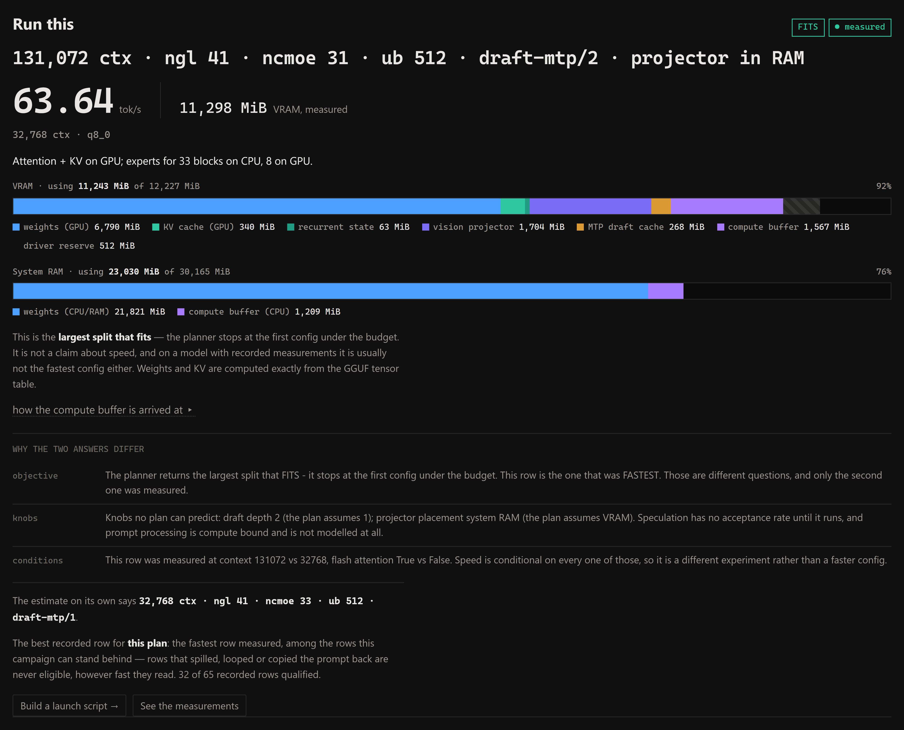
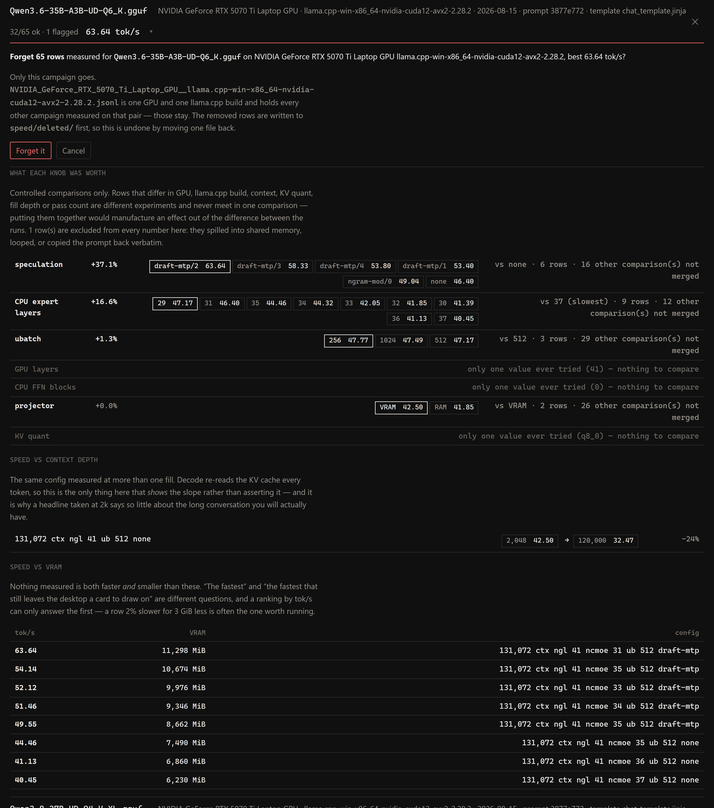

# Speed: the estimate, the measurement, and why they disagree

The planner answers a memory question. A speed campaign answers a speed question.
Those are different questions, and the tool's job is to say so and then measure.

[← back to the README](../README.md)

---

## Generation speed

Token generation is **memory-bandwidth bound**, not compute bound: every token
streams each *active* weight exactly once. So

```
seconds/token = gpu_bytes/BW_vram + cpu_bytes/BW_ram
```

The byte counts are exact (tensor table, `n_expert_used/n_expert` of the expert
weights, plus the KV re-read that grows as the context fills). The bandwidths are
not, so the planner reports a **bracket** until you calibrate it. Peak VRAM and RAM
bandwidth are auto-detected (`nvidia-smi` memory clock × inferred bus width;
`Win32_PhysicalMemory` speed × total data width) and both fields are editable.

The bracket is wide for a reason: scattered MoE expert gathers over system RAM run
far below peak, while contiguous streaming runs near it. One measurement collapses
it. Three sources, in order of usefulness:

1. **Benchmark the loaded model.** In step 1, under *Settings the planner suggests…*,
   press **Benchmark the loaded model**; it runs one short generation
   against `localhost:1234` and reads `tokens_per_second` out of LM Studio's native
   `/api/v0/chat/completions` stats block. Results are appended to
   `speed_history.json` next to the script. **This is the one that works in server
   mode** — if you drive LM Studio from an API client (opencode, Continue, aider…)
   rather than its chat UI, nothing is written to the chat history, so there is
   otherwise no tok/s to mine.
2. **Saved chats** — `~/.lmstudio/conversations/*.conversation.json` record
   `tokensPerSecond`, `numGpuLayers` and the load config per generation. Only
   populated by the in-app chat.
3. **Server logs** — `~/.lmstudio/server-logs` bracket each response with
   `Streaming response...` → `Prompt processing progress: 100.0%` →
   `Finished streaming response`, giving real **prefill vs decode wall times**. The
   succinct log has no token counts so it cannot produce tok/s, but it answers the
   more important question: which half of the pipeline your time actually goes to.

**Prompt processing is not modelled.** It is compute bound rather than bandwidth
bound and needs a device FLOPS figure plus a kernel-efficiency factor that varies
too much to be worth pretending about.


## "Largest that fits" is not "fastest" — and the two used to disagree silently

The planner and the speed sweep answer different questions, and for a long time
neither of them said so.

**The planner returns the largest split that fits.** On a dense model that does
not fit, it returns two of them — one per question. *Plan for speed* pins `-ngl`
at every block and exiles every block's dense FFN to RAM (`-ot`), then solves for
the largest context that still fits; *plan for context* holds the context you
asked for and walks `-ngl` down until it fits, with the same FFN exile. On an MoE
`_plan_moe` searches up from `--n-cpu-moe 0` for the first split that fits. All of
them stop at the first feasible config. That is a **memory** answer.

**Which question you are asking is a control, not a discovery.** *Plan for* sits
in tier 1 of the form, above **Analyze fit**: *Auto*, *Speed*, *Context*. Auto —
the default — takes the speed plan whenever it already covers the context you
typed, and the context plan when it does not. `analyze()` returns **both** plans
whichever one you pick, so the toggle over the results flips between them with no
round trip; the chips and that toggle are two renderings of one variable, and it
rides the next analyze and the speed campaign as well, so the sweep optimises the
plan you are looking at. A model that fits whole, and an MoE — whose
`--n-cpu-moe` has one answer — have no such choice, and the card says so rather
than leaving a control that silently does nothing.

**The sweep returns the best row it measured** — and what "best" means follows
the category, because the two do not share an objective. Each dense plan pins one
placement and leaves exactly one knob free: the **context** in the speed plan,
the **`-ot` exile** (then `-ngl`, once a full exile is not enough) in the context
plan. Along a knob that is monotone in VRAM the value worth having is the one at
the **wall**, not the one that read fastest — measured rows move 4.2% of tok/s
across a *doubling* of context, and downward, so ranking a speed campaign by
tok/s recommends the smallest window in the mode whose whole purpose is the
largest one. So the recommendation ranks the way the campaign promotes:
`recommend.mode_axis()` names the free knob and `bench.pick_extreme()` takes the
extreme along it, with `STAGE_EXTREME_SLACK` refusing a rung that loaded and then
thrashed. Off the two-plan regime nothing is left free and fastest-wins stands.

Either way it is a **measured** answer, and it coincides with the plan only if
throughput rises monotonically with offload. It does not:

- a row that spills into shared system memory *loads*, reports `ok`, and runs
  off a cliff — so the biggest thing that "fits" can be the slowest thing you
  can run;
- MTP's draft cache costs VRAM the plan was not asked to price, and on one model
  moved the OOM wall a whole `-ngl` rung;
- a DFlash drafter (a `dflash-*.gguf` next to the model) is a second set of
  weights in the same process — the plan prices it when you tick DFlash, and the
  difference can be several `-ngl` rungs on a 16 GB card;
- `ubatch` and speculation move tokens/second without moving any number the
  planner computes at all.

On top of that, the two used to be handed **different budgets**. The browser
prefilled its VRAM budget from *free VRAM at page load* with a zero reserve,
while `bench.planner_split()` seeded the sweep's ladder from *card total* minus
512 MiB. On a 12 GB card with something already loaded that is the difference
between 299 MiB and 11,715 MiB — several rungs, for a reason nothing on the page
mentioned.

Three things changed:

1. **One budget rule.** `plan.default_vram_budget()` is the only definition, and
   both callers use it. The web UI's *Expert* tier exposes the basis as a
   control — *card total* (the default, and what a campaign measures under) or
   *free right now* — and says plainly when you have picked the one that will
   disagree with your measurements.
2. **The verdict is computed once**, server-side, in `plan._verdict()`, and
   reported on the same basis the memory bar draws. The browser used to derive
   its own reading of the same fields, and the step tab's copy of that logic read
   two keys the API has never returned — so it announced "fits" for **every**
   plan, including the ones that did not.
3. **`recommend.recommend()` reconciles the two.** A trustworthy measured row
   supersedes the estimate; rows that spilled, looped or copied the prompt back
   are never eligible however fast they read. It answers for the **category on
   screen**: the card is badged `for speed` / `for context` and says which
   criterion picked the row — *the largest context that loaded*, *the least dense
   FFN exiled to RAM that loaded* — and switching the toggle re-asks it. When the two answers differ, the
   card at the top of the page names each reason — `objective`, `budget`,
   `axis` (knobs no plan can predict), `depth`, `samplers` and `stale` — instead
   of leaving you to notice that step 1 said `ncmoe 32` and step 2's best row
   said `ncmoe 31`. `budget` compares the two **after** each side's reserve and
   safety margin, since that is the number a split is actually chosen against;
   comparing the raw field reported a difference on every plan, including the
   default one where there is none.



That is a real reconciliation on a real store — the planner's own answer for this model
is `ncmoe 32`, the fastest row it can stand behind is `ncmoe 31` with speculation on and
the projector in system RAM, and every reason for the gap is named.

If nothing has been measured, the card says `estimated` and shows the planner's
config. That is the right answer before you have spent the two hours; it is just
not the same claim.


## Measuring speed

The roofline above predicts decode from bytes and bandwidth. Two settings move real
tok/s a long way and are invisible to it, so there is a second harness for them:

- **Speculative decoding.** `speed.py` has no acceptance-rate term, and
  `per_token_bytes()` skips MTP blocks because they do not run during ordinary decode.
  The planner can price what speculation *costs* — a draft cache, quant and all
  (llama.cpp keeps it f16 whatever `--cache-type-k` says; `--speed-spec-kv q8_0` pins the
  draft cache's own `-ctkd/-ctvd` pair) — and nothing of what it saves.
- **The dense-FFN `-ot` split.** Both dense plan modes are built on it — pinning whole
  blocks' FFN tensors to the CPU with `--override-tensor` frees VRAM without losing KV,
  which layer offload always drags off with it. Its real per-token cost is exactly the
  sort of thing the roofline should not be believed for, which is why the mode you pick
  decides what stage A of the sweep then measures.
- **Prompt processing**, which is not modelled anywhere here on purpose.

Run it **from the web UI** — step 2, *Measure real speed* — or from the command line:

```
python -m vram_planner --speed-sweep --dry-run     # the grid and the estimate
python -m vram_planner --speed-sweep               # hours; resumable
python -m vram_planner --speed-sweep --speed-chain # each stage built from what won
python -m vram_planner --speed-report              # every row, fastest first
python -m vram_planner --speed-report --insights   # what the campaigns FOUND
python -m vram_planner --speed-sweep --speed-axes "ngl=28,30 spec=draft-mtp spec_n_max=1,2,3"
python -m vram_planner --speed-sweep --speed-mode speed    # sweep context at -ngl all
python -m vram_planner --speed-sweep --speed-mode context  # sweep -ngl at a fixed context
python -m vram_planner --speed-sweep --speed-ot 8   # pin FFN of the first 8 blocks to CPU
```

In the browser it is the same harness: it takes context and KV quant from the form and
freezes them, previews the grid before committing hours to it, shows rows as they land,
and stops between configs rather than mid-measurement — nothing is lost either way,
because every row is already on disk and keyed, so starting again resumes. It refuses to
start while anything else holds the GPU, and names what: a resident model does not make
the sweep *fail*, it makes every row wrong in the same direction, which is worse.

A config that is clearly not going to work (a server that wedges, for instance) can be
abandoned without ending the campaign: press **S** in the terminal or **Skip run** in the
browser. The run is killed on the spot — otherwise a hung server sits out the whole
generation timeout — its row is recorded as `skipped` so a resumed sweep never re-measures
it, and the next config starts.

The machine makes the same judgement itself: a pass at a fraction of what the model
normally delivers means WDDM spilled the process into shared memory or the card is busy,
so the measurement is **aborted** and the row recorded as `spilled` — keyed and never
re-measured, like `skipped`, instead of crawling to the end and landing as a
plausible-looking number that has to be explained away later.

### Chaining the stages

By default the grid is staged one knob at a time from **one fixed baseline**, so ubatch
and speculation are measured at a layer split that stage A has not confirmed. `--speed-chain`
(ticked by default in the browser) builds each stage *after* the previous one finishes,
from the fastest trustworthy row so far. **Same number of loads, so the same hours** — it
is not a wider search, it is the same search with the baseline kept honest.

Two rules keep it from being worse than the fixed version. A row that **spilled** into
shared memory or that caught the model **looping** is never carried forward: it would bend
every later stage in the same direction, silently. And a challenger has to win by more
than **2%**, because `tok_s` is a median of a few passes — rebasing on jitter would make
the campaign's path depend on noise rather than on anything it measured.

`--speed-rounds N` re-runs the stages from the winner. It is cheap by construction: the
resume key does not include the stage letter, so a config a later round revisits unchanged
is already recorded and is skipped, and only genuinely new combinations cost time.

### Reading a campaign back

A ranking says which config won. It does not say what the campaign *learned*, and those
are different — "1024 is the fastest ubatch" is worth much less than "ubatch is worth 6%
and speculation is worth 41%", because only the second tells you where the next two hours
should go. `--speed-report --insights`, and the **Past sweeps** card in the browser, give:

| | |
|---|---|
| what each knob was worth | best value vs its natural reference, with the effect size |
| speed vs context depth | the same config at more than one fill — the slope, not an assertion |
| speed vs VRAM | the rows nothing beats on *both*, since "fastest" and "fastest that leaves the desktop a card" are different questions |

Every effect comes from a **controlled comparison**: rows are bucketed by everything
*except* the axis in question, and rows differing in GPU, llama.cpp build, context, KV
quant, fill depth or pass count are different experiments that never meet. Averaging
across them would manufacture an effect out of the difference between the runs. An axis
measured at only one value is reported as such rather than dropped — "we never varied
this" is itself usually the actionable finding.

Past sweeps needs **no model analyzed and touches no GPU**: it is what the page shows
before you have pressed Analyze, and you can pick any historical row and generate a launch
script straight from it. Rows record a model's *basename*, so if the file has moved or was
measured on another machine the script is still written in full, with a header line saying
the path did not resolve — the flags are the valuable part and the path is one edit.

**[docs/speed-sweep.md](speed-sweep.md) is the full guide** — the staged design,
freezing context/KV, why the primary knob inverts on MoE, the axis reference, and the
measurement discipline (bracketing controls, why greedy overstates speculation, and the
repetition check that catches a fake acceptance rate).

The prompt is a **frozen corpus** — this README plus the sources, snapshotted into
`vram_planner/_corpus.txt` and committed. That half-megabyte file is not build output:
every row records the corpus's hash, so if the file ever disappeared and were rebuilt
from a changed tree, every deep-fill row you ever measured would become a different
experiment and stop merging with new ones. It changes only when you deliberately run
`--refresh-corpus`, which re-keys the rows so the re-measure is visible rather than
silent.

It launches `llama-server` per config, sizes the prompt with the server's own
`/tokenize` so "32k of context" means 32k, runs **one cold pass** (that is the prefill
measurement) and then **three cache-warm passes** (pure decode, median reported), and
stores the whole `timings` block — including `draft_n` / `draft_n_accepted`, so a
speculative result arrives with the acceptance rate that explains it.

Rows go to `speed/`, **not** `sweeps/`. That separation is load-bearing: `fit.py` globs
every `.jsonl` under `sweeps/` and fits anything `suspect_reason()` accepts, and
`compute.py` has no term for a draft cache — those megabytes would be absorbed into
`floor` and `ctx` and quietly corrupt every future plan.

Two traps it is built around. The filler prompt is this repository's own README and
sources, snapshotted once per process: real prose and code, because a prompt built by
repeating one paragraph hands n-gram speculation a result it could never reproduce on
real work, and re-reading a live working tree mid-campaign makes early and late rows
incomparable. And each row records a sample of what was generated plus a
`distinct_ratio` over its 8-word windows, because `temperature 0` with `ignore_eos` can
put a model in a repetition loop, which is exactly what n-gram speculation predicts
perfectly — the ratio is how you tell a real speculative win from an artefact of the
harness.

### Forgetting a campaign



Press **✕** on a row in **Past sweeps**, or:

```bash
python -m vram_planner --forget-sweep Qwen3.6-35B-A3B   # lists, then asks
python -m vram_planner --forget-sweep Qwen3.6 --yes     # no prompt
```

A model name matches on substring and case-insensitively, so the CLI prints every
campaign that matched — model, GPU, row count, best tok/s, date — and asks before it
removes anything. The browser asks twice for the same reason. What a campaign cost is
the two hours of GPU time that produced it, and a mistyped name is cheap.

Three things it is careful about:

- **The file is never unlinked.** A `.jsonl` under `speed/` is one GPU and one llama.cpp
  build, so it holds every campaign ever measured on that pair. Removing one model's rows
  by deleting the file would take the rest with it; the file is rewritten without those
  rows instead, and lines the tool cannot parse are left exactly where they were.
- **The removed rows are moved, not dropped.** They land in `speed/deleted/` under the
  original name plus a timestamp, so a delete is undone by moving one file back. If the
  backup cannot be written, nothing is deleted — a delete that cannot be undone is a
  different operation from the one that was asked for. Two campaigns forgotten in the
  same second get two files, not one on top of the other.
- **The rewrite is atomic, and never lands on top of an append.** The browser refuses
  outright while a campaign is running, but it can only see the job in its own process —
  a `--forget-sweep` in a terminal knows nothing about a campaign running in a browser.
  So the file itself is fingerprinted before it is read and again before it is replaced,
  and a delete that would drop a row measured in between is abandoned instead.

Deleting rows can change what the recommendation card shows — including back to the
planner's estimate, if what went was the only trustworthy campaign for that model.
